# LAPORAN PERTEMUAN 1

## 1. Latihan Konseptual

### Latihan 1.1

#### SOAL

Jelaskan 5 fungsi utama sistem operasi dengan contoh konkret dari minimal 2 OS berbeda (Windows, macOS, atau Linux).

#### JAWABAN

Sistem Operasi (OS) berfungsi sebagai perantara antara pengguna dan perangkat keras, memastikan seluruh sumber daya dikelola secara efisien. Berikut adalah 5 fungsi utama beserta contohnya pada Windows dan Linux:

##### 1. Process Management

Sistem operasi bertanggung jawab untuk mengatur pembuatan, penjadwalan, dan penghentian proses (program yang sedang berjalan). OS memastikan setiap aplikasi mendapatkan waktu prosesor (CPU) secara adil.

* **Contoh Windows:** **Task Manager** yang memungkinkan pengguna melihat aplikasi mana yang memakan banyak CPU dan menghentikannya jika perlu.
* **Contoh Linux:** Perintah `top` atau `htop` di terminal untuk memantau proses secara *real-time* dan manajemen sinyal proses menggunakan `kill`.

##### 2. Memory Management

Fungsi ini melacak bagian memori (RAM) yang sedang digunakan dan oleh siapa. OS mengalokasikan ruang memori saat program membutuhkan dan membebaskannya saat program selesai.

* **Contoh Windows:** Penggunaan **Virtual Memory** (file `pagefile.sys`) saat kapasitas RAM fisik sudah hampir penuh.
* **Contoh Linux:** Penggunaan **Swap Partition** atau **Swap File** untuk memperluas kapasitas memori secara virtual di atas disk.

##### 3. Storage Management

OS mengelola penyimpanan data dalam bentuk file dan direktori, termasuk hak akses dan organisasi data pada media penyimpanan.

* **Contoh Windows:** Penggunaan file system **NTFS** yang mendukung fitur kompresi dan enkripsi file.
* **Contoh Linux:** Penggunaan file system **ext4** atau **Btrfs** yang memiliki struktur hirarki yang dimulai dari root (`/`).

##### 4. Device Management

OS berkomunikasi dengan perangkat keras (I/O) melalui driver. Ini mencakup manajemen disk drive, kartu grafis, printer, hingga keyboard.

* **Contoh Windows:** **Device Manager**, tempat pengguna bisa memperbarui driver kartu grafis (misal: NVIDIA) atau mendiagnosis perangkat yang tidak terbaca.
* **Contoh Linux:** Perintah `lspci` (untuk perangkat PCI) atau `lsusb` (untuk perangkat USB) untuk mengidentifikasi perangkat keras yang terdeteksi oleh kernel.

##### 5. Security and Protection

OS melindungi sumber daya dan data dari akses yang tidak sah, serta memastikan satu proses tidak mengganggu proses lainnya.

* **Contoh Windows:** Fitur **User Account Control (UAC)** yang meminta konfirmasi admin sebelum menjalankan aplikasi yang berpotensi mengubah sistem.
* **Contoh Linux:** Sistem **File Permissions** (read, write, execute) dan penggunaan perintah `sudo` (superuser do) untuk memberikan hak akses administratif secara terbatas.

### Latihan 1.2

#### Soal
Kapan sebaiknya menggunakan Windows vs Linux vs macOS? Analisis berdasarkan use case: gaming, development, server, creative work, dan enter-prise.

#### Jawaban
Berikut adalah analisis pemilihan sistem operasi berdasarkan *use case* spesifik, yang disusun berdasarkan materi perbandingan sistem operasi pada laporan praktikum dan referensi mata kuliah Sistem Operasi:

##### 1. Gaming

* **Pilihan Utama:** **Windows**
* **Alasan:** Memiliki dukungan **DirectX** yang merupakan standar industri *game* modern. Windows juga memiliki kompatibilitas *driver* perangkat keras paling luas (seperti GPU NVIDIA/AMD) dan perpustakaan *game* terbesar (Steam, Epic Games, dll).
* **Linux/macOS:** Meski Linux mulai berkembang dengan *tool* seperti Proton, kompatibilitasnya belum se-inklusif Windows. macOS sangat terbatas untuk *gaming* berat karena pustaka *game* yang sedikit.

##### 2. Development (Pengembangan Perangkat Lunak)

* **Pilihan Utama:** **Linux** atau **macOS**
* **Alasan:**
* **Linux:** Memberikan lingkungan *native* yang kuat untuk pemrograman (terutama *backend*, AI, dan *cloud*). Memiliki manajemen paket (`apt`, `pacman`) yang memudahkan instalasi *library* dan alat pengembangan.
* **macOS:** Berbasis Unix yang stabil, sangat populer untuk pengembangan aplikasi *mobile* (Wajib untuk pengembangan iOS/macOS) dan pengembangan web.

* **Windows:** Sekarang menjadi pilihan kompetitif berkat **WSL (Windows Subsystem for Linux)** yang memungkinkan menjalankan lingkungan Linux di dalam Windows.

##### 3. Server

* **Pilihan Utama:** **Linux**
* **Alasan:** Standar industri untuk infrastruktur internet. Linux sangat efisien karena dapat berjalan tanpa antarmuka grafis (GUI) yang memakan banyak RAM. Memiliki tingkat keamanan yang tinggi, stabilitas jangka panjang (uptime), dan bersifat *open-source* sehingga tidak memerlukan biaya lisensi yang mahal.
* **Windows:** Digunakan pada skala **Enterprise** yang spesifik menggunakan teknologi Microsoft seperti .NET atau Active Directory.

##### 4. Creative Work (Desain, Video, Audio)

* **Pilihan Utama:** **macOS**
* **Alasan:** Memiliki optimasi perangkat lunak dan perangkat keras yang sangat baik. Standar industri untuk desain grafis dan video editing karena akurasi warna dan stabilitas sistem saat menjalankan aplikasi berat (Adobe Creative Cloud, Final Cut Pro).
* **Windows:** Pilihan kedua yang sangat baik karena fleksibilitas perangkat keras (bisa menggunakan spesifikasi PC yang sangat tinggi) dan dukungan penuh aplikasi Adobe.

##### 5. Enterprise (Lingkungan Bisnis)

* **Pilihan Utama:** **Windows**
* **Alasan:** Mendominasi dunia perkantoran karena ekosistem **Microsoft Office** dan kemudahan manajemen terpusat menggunakan **Active Directory**. Sebagian besar aplikasi bisnis dan administrasi dirancang khusus untuk berjalan di Windows.

## 2. Latihan Praktikal

### Latihan 1.3

#### Soal
Install Ubuntu 24.04 LTS dengan WSL

1. Persiapan dan Aktivasi WSL
2. Restart Komputer
3. Konfigurasi Ubuntu

#### Jawaban

##### Persiapan dan Aktivasi WSL
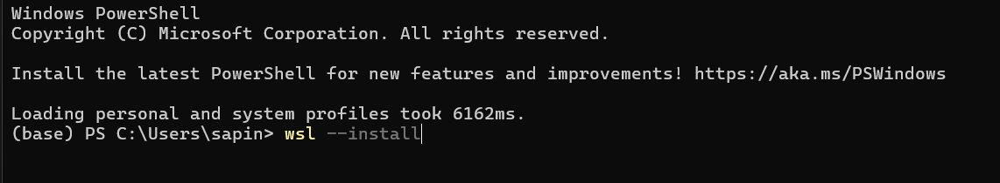

##### Restart Komputer
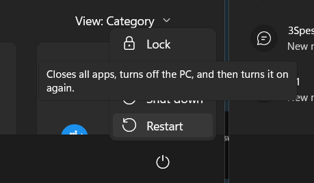

##### Konfigurasi Ubuntu
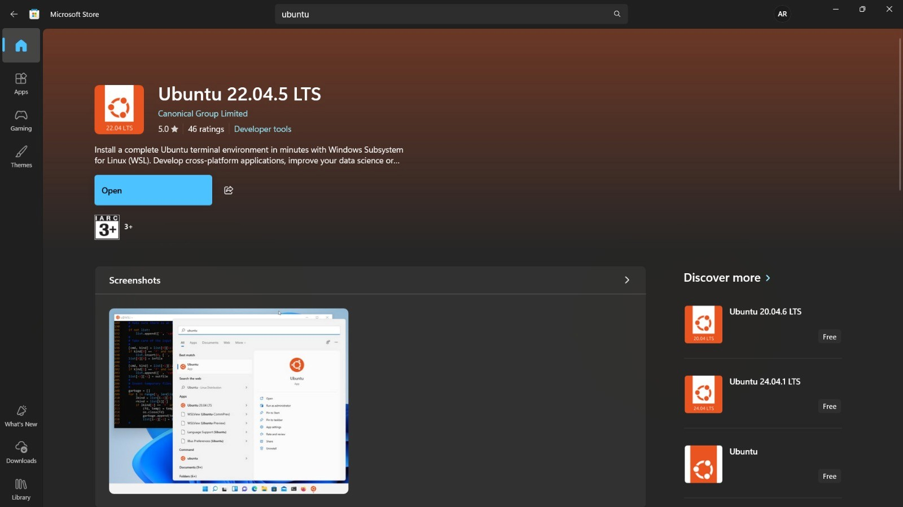
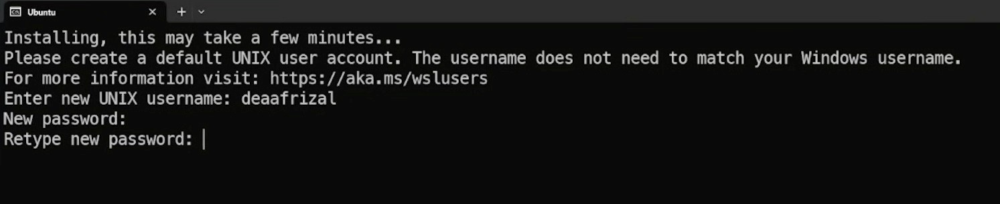

### Latihan 1.4

#### Soal
Setelah instalasi Ubuntu Server, lakukan tasks berikut:
1. Update package list: sudo apt update
2. Upgrade packages: sudo apt upgrade
3. Install neofetch: sudo apt install neofetch
2. Jalankan neofetch dan screenshot hasilnya
5. Check disk usage dengan df -h
6. Check memory dengan free -h
7. Dokumentasikan output dari setiap command

#### Jawaban

##### Update package list
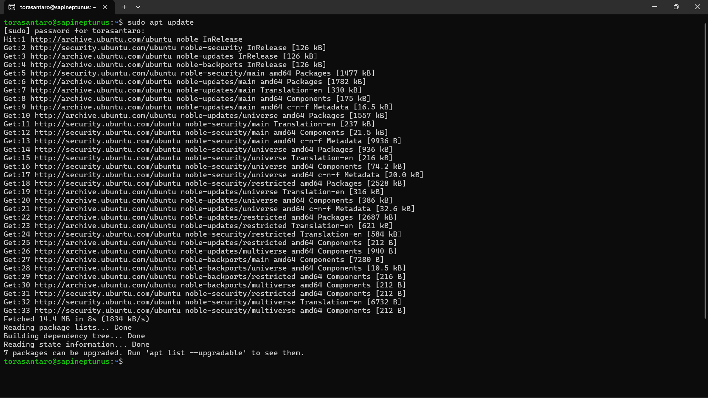

##### Upgrade packages
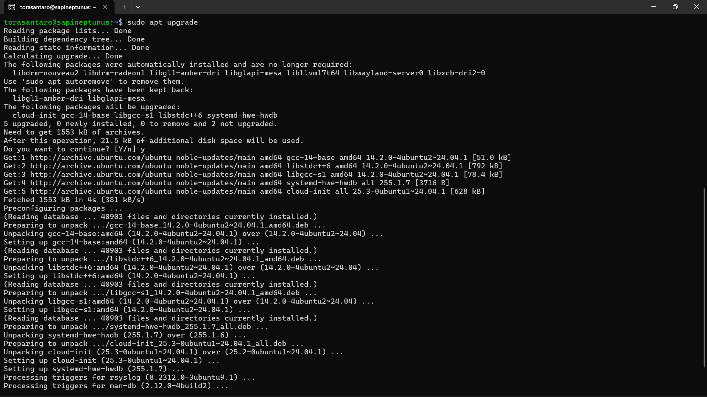

##### Install neofetch
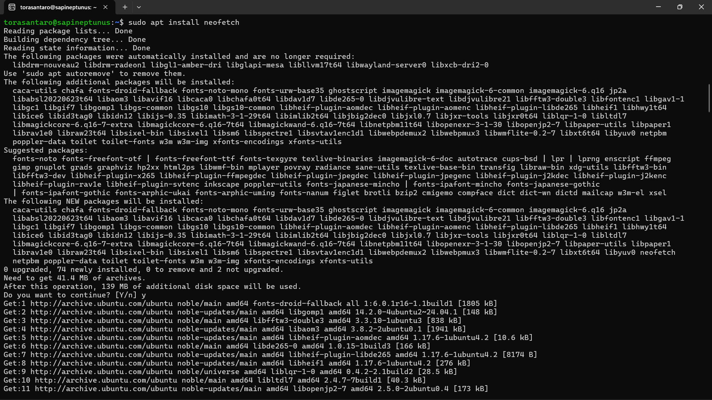

##### Jalankan neofetch
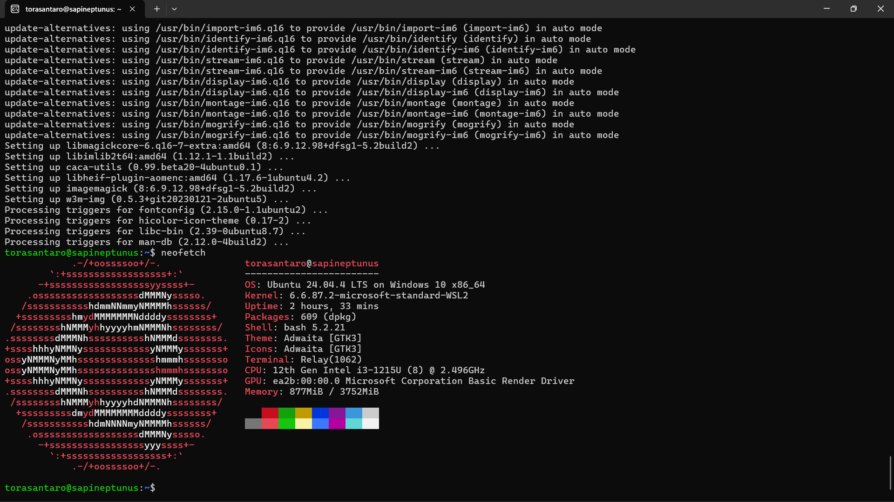

##### Check disk usage dengan df -h
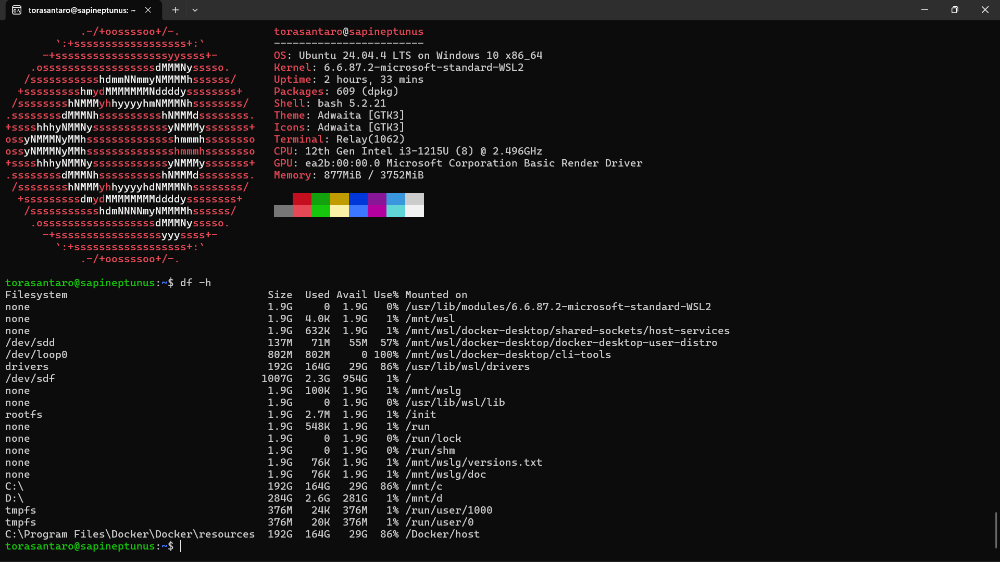

##### Check memory dengan free -h
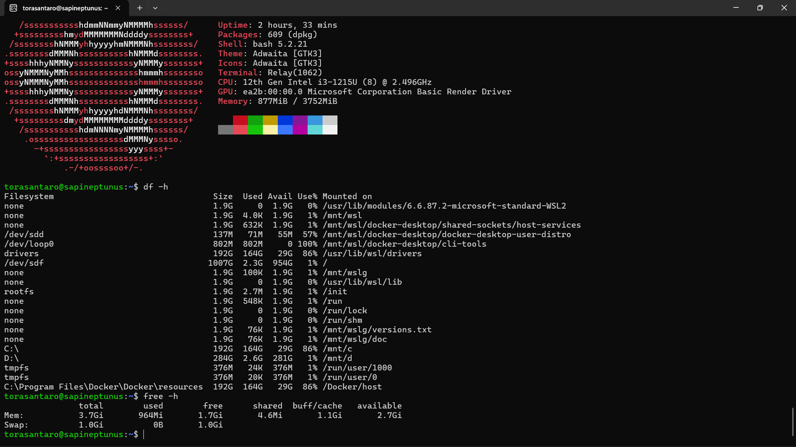

### Latihan 1.5

#### Soal
Eksplorasi sistem yang baru diinstall:
1. Tampilkan informasi OS: cat /etc/os-release
1. Tampilkan versi kernel: uname -r
2. List partisi: lsblk
4. Check network connectivity: ping -c 4 google.com
5. Install dan jalankan htop untuk melihat resource usage
1. Buat laporan singkat tentang konfigurasi sistem Anda

#### Jawaban

##### Menampilkan informasi OS

##### Menampilkan versi kernel
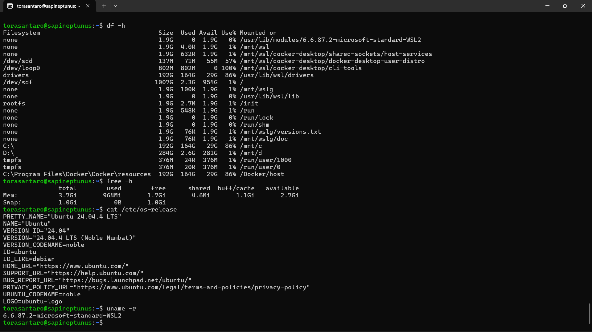

##### Menampilkan list partisi
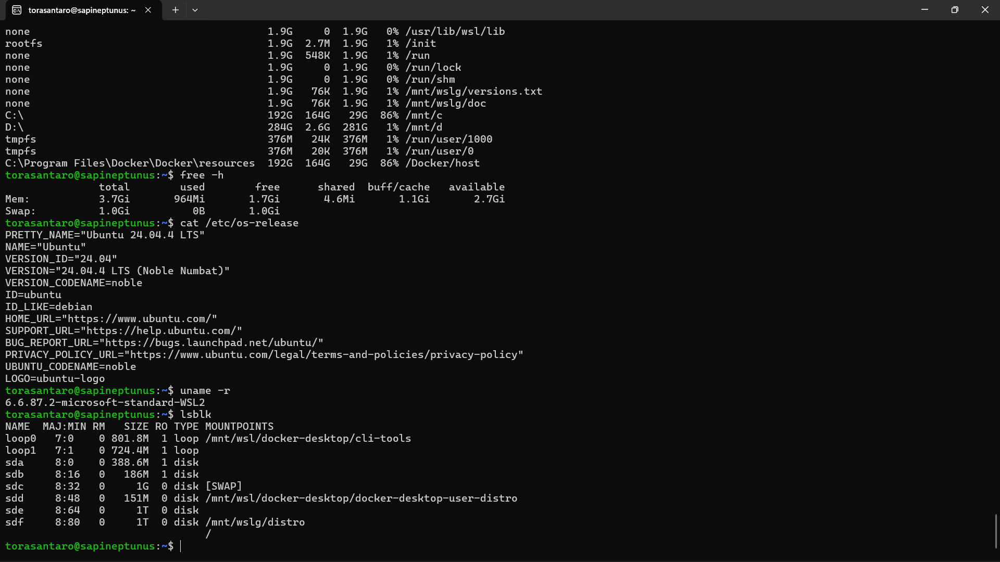

##### Checking network connectivity
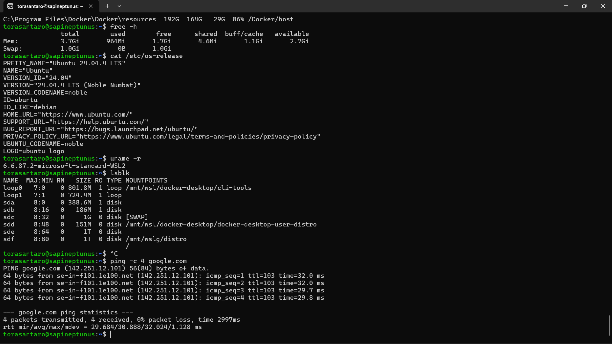

##### Installing htop
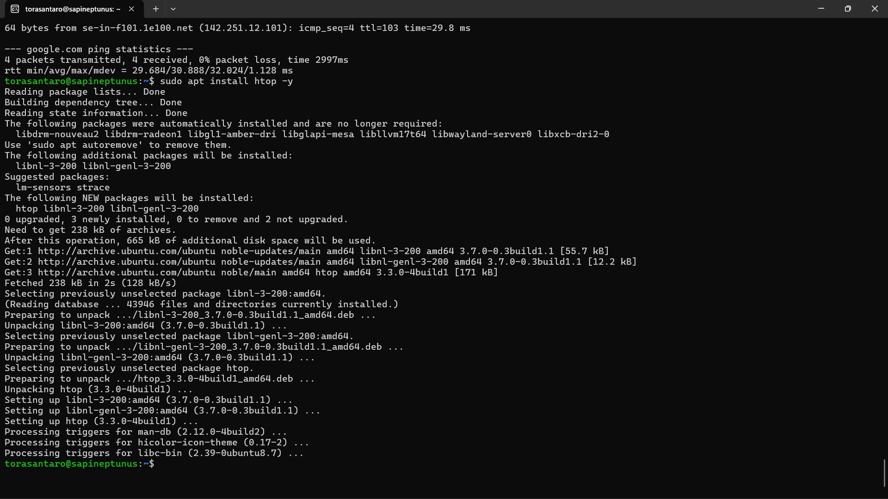

##### Menjalankan htop untuk melihat resource usage
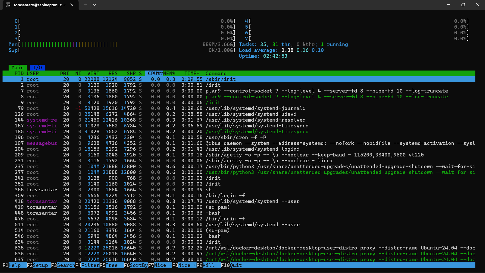

##### Laporan singkat tentang konfigurasi sistem

| Komponen | Detail Konfigurasi |
| --- | --- |
| **Sistem Operasi** | Ubuntu 24.04.4 LTS on Windows 10 x86_64 |
| **Versi Kernel** | 6.6.87.2-microsoft-standard-WSL2 |
| **Arsitektur CPU** | 12th Gen Intel i3-1215U (8) @ 2.496GHz |
| **Kapasitas RAM** | 8.00 GB |
| **Konektivitas** | *Success* |

## 3. Latihan Refleksi

### Latihan 1.6

#### Soal
Ceritakan pengalaman Anda dengan sistem operasi:
1. Sistem operasi apa yang Anda gunakan sehari-hari? (Windows, macOS,
Linux, atau lainnya)
1. Berapa lama Anda menggunakan sistem operasi tersebut?
2. Apa yang Anda sukai dari sistem operasi tersebut?
3. Apa tantangan atau masalah yang pernah Anda hadapi?
4. Apakah Anda pernah menggunakan sistem operasi lain? Bandingkan
pengalaman Anda.
1. Setelah mempelajari bab ini, apakah ada sistem operasi lain yang ingin
Anda coba? Mengapa?
Tulis refleksi Anda dalam 300-500 kata disertai dengan dokumentasi.

#### Jawaban
Sehari-hari, saya menggunakan Windows 11. Saya sudah memakai Windows sejak kecil, mungkin sekitar 3 tahun lebih. Alasan saya menyukainya sangat sederhana, windows itu mudah digunakan. Semua tinggal klik, tampilannya bagus, dan hampir semua aplikasi yang saya butuhkan bisa berjalan di sana tanpa ribet.

Mungkin itu adalah jawaban jika saya bertanya pada ai, namun alasan sebenarnya itu simpel, karena windows sudah terpasang di laptop saya saat saya pertama kali menggunakannya setelah dibelikan oleh orang tua saya ketika SMA. Ketika itu saya bahkan tidak peduli windows itu apa dan linux pun saya tidak pernah mendengar nya sekalipun. Apa yang saya butuhkan hanyalah laptop yang bisa digunakan untuk membuat laporan tugas, ppt presentasi, dan hal lain lain.

Namun, setelah masuk ke jurusan TI di Polinema, saya mulai menemui tantangan. Laptop saya menggunakan prosesor Intel i3 dengan RAM 8GB. Awalnya, saya mencoba menjalankan Linux di dalam Windows menggunakan aplikasi VirtualBox. Ternyata, laptop saya terasa sangat berat dan lambat karena harus menjalankan dua sistem operasi sekaligus secara penuh. Akhirnya, atas saran dari materi kuliah, saya beralih menggunakan WSL (Windows Subsystem for Linux).

Pengalaman menggunakan Ubuntu di WSL ini membuka mata saya. Di Linux, saya tidak bisa lagi hanya mengandalkan klik mouse. Saya harus belajar mengetik perintah di terminal. Awalnya terasa kaku, tapi lama-lama saya sadar bahwa mengetik perintah itu jauh lebih cepat dan efisien. Perbedaannya sangat terasa.

Salah satu pelajaran penting yang saya petik bukan hanya soal teknis, tapi soal ketelitian. Belakangan ini, saya sempat mengalami masalah karena kurang teliti dalam transaksi online dan urusan perbankan sampai akun saya terblokir. Ternyata, di Linux pun sama. Satu salah ketik perintah, sistem bisa kacau. Belajar Linux secara tidak langsung melatih saya untuk menjadi pribadi yang lebih hati-hati dan tidak ceroboh.

Sekarang saya terpikirkan untuk menggunakan linux sepenuhnya di laptop saya, namun itu masih saya pertimbangkan lebih lanjut.

