# PERTEMUAN 10

## Praktikum 10.1 — Melihat Penggunaan Memori

### 1. Jalankan `free -h` untuk melihat ringkasan RAM dan swap.
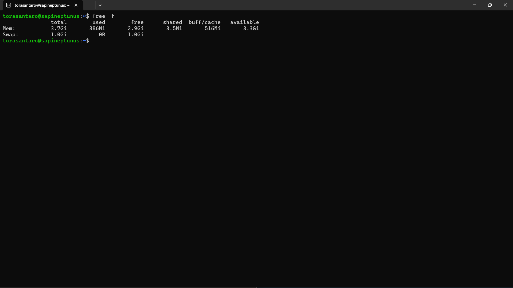

### 2. Lihat detail memori dari kernel melalui `/proc/meminfo`.
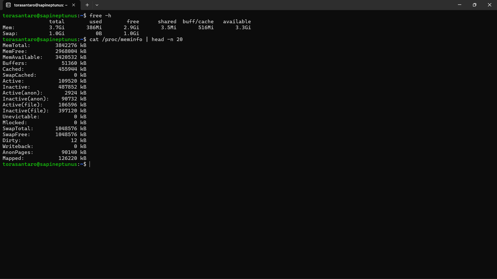

## Analisis 10.1

### 1. Hitung persentase memori tersedia: available / total × 100%. Jika hasilnya di bawah 10%, sistem mulai kekurangan memori.
Berdasarkan output perintah `free -h` pada sistem, diperoleh data sebagai berikut:
* **Total Memori (total):** 3.7 GiB
* **Memori Tersedia (available):** 3.3 GiB

**Rumus Perhitungan:**
$$(\text{Available} / \text{Total}) \times 100\%$$
$$(3.3 / 3.7) \times 100\% = 89.18\%$$

**Analisis:**
Hasil perhitungan menunjukkan bahwa persentase memori yang tersedia adalah sebesar **89.18%**. Karena nilai ini jauh di atas ambang batas kritis **10%**, maka kondisi penggunaan memori pada sistem saat ini dikategorikan **Sangat Normal** dan masih memiliki ruang yang luas untuk menjalankan proses tambahan.

### 2. Pada baris Swap, apakah kolom used bernilai 0? Jika lebih dari 0, kernel sudah pernah memindahkan data ke disk karena RAM tidak cukup.
Berdasarkan kolom `Swap` pada baris kedua output `free -h`:
* **Used:** 0B

**Analisis:**
Kolom `used` pada baris Swap menunjukkan nilai **0B**. Hal ini mengindikasikan bahwa kernel Linux belum pernah memindahkan data dari RAM ke disk (paging out). Kondisi ini terjadi karena kapasitas RAM fisik masih mencukupi untuk menangani seluruh beban kerja sistem, sehingga mekanisme *virtual memory* menggunakan partisi/file swap belum diperlukan.

### 3. Perhatikan field Cached dan Buffers di `/proc/meminfo`. Nilai ini sesuai dengan kolom `buff/cache` pada `free -h`.
Berdasarkan observasi pada file `/proc/meminfo` dan perintah `free -h`:

* **Data /proc/meminfo:**
    * `Buffers`: 51360 kB (~50.1 MiB)
    * `Cached`: 455944 kB (~445.2 MiB)
* **Data free -h:**
    * `buff/cache`: 516 MiB

**Analisis:**
Nilai `buff/cache` pada perintah `free -h` merupakan akumulasi dari field `Buffers` dan `Cached` yang ada di `/proc/meminfo`. Jika dijumlahkan secara manual ($50.1 + 445.2 = 495.3$ MiB), terdapat sedikit selisih dengan tampilan `free -h` (516 MiB). Hal ini dikarenakan perintah `free` juga memasukkan nilai **SReclaimable** (memori kernel yang dapat diambil kembali) ke dalam kategori `buff/cache` untuk memberikan informasi yang lebih akurat mengenai total memori yang bisa dibebaskan sewaktu-waktu oleh sistem operasi.

## Praktikum 10.2 — Mengamati Aktivitas Paging

### 1. Jalankan `vmstat` dengan interval 1 detik, 5 sampel.
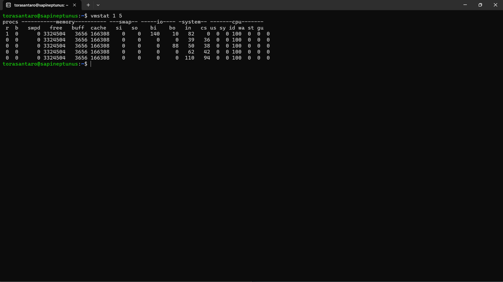

## Analisis 10.2

### 1. Amati nilai `si` dan `so` pada kelima baris. Pada sistem normal dengan RAM cukup, kedua nilai ini selalu `0`.
Pada kelima baris output yang dihasilkan, nilai pada kolom **si** dan **so** secara konsisten menunjukkan angka **0**. Hal ini mengindikasikan bahwa selama rentang waktu 5 detik pengambilan sampel, tidak ada data yang dipindahkan dari disk ke RAM maupun sebaliknya.

**Kesimpulan:** Sistem berada dalam kondisi **Normal** dengan kapasitas RAM fisik yang sangat mencukupi untuk menangani beban kerja saat ini.

### 2. Jika nilai `si` atau `so` sesekali muncul lebih dari `0`, artinya pernah ada aktivitas swap. Ini masih wajar jika tidak terus-menerus.
Meskipun sistem normal, nilai `si` atau `so` yang sesekali muncul di atas **0** (namun tidak terus-menerus) dapat dianggap sebagai aktivitas yang wajar. Namun, pada pengamatan kali ini, tidak ditemukan lonjakan nilai tersebut sama sekali. Ini memperkuat bukti bahwa memori virtual belum perlu bekerja ekstra karena ketersediaan RAM fisik masih sangat lega.

### 3. Jika `si` dan `so` terus-menerus lebih dari `0`, sistem dalam kondisi memory pressure serius — performa turun drastis karena akses disk jauh lebih lambat dari RAM.
Sistem tidak menunjukkan tanda-tanda *memory pressure* serius. Kondisi kritis hanya terjadi jika nilai `si` dan `so` terus-menerus bernilai tinggi, yang akan menyebabkan penurunan performa karena sistem dipaksa mengakses disk yang jauh lebih lambat daripada RAM. Berdasarkan data gambar, sistem beroperasi pada performa maksimal tanpa hambatan akses disk terkait memori.

### 4. Perhatikan juga kolom `free` (RAM kosong) dan `buff` (buffer) untuk memahami kondisi keseluruhan RAM saat itu.
Untuk memahami kondisi RAM secara keseluruhan, berikut adalah nilai yang terbaca pada kolom memori:
*   **free (RAM Kosong):** Terbaca konstan pada angka **3.324.504** KB (sekitar 3,17 GiB).
*   **buff (Buffer):** Terbaca konstan pada angka **3.656** KB.

**Analisis:**
Ketersediaan RAM yang "benar-benar kosong" (`free`) masih sangat besar. Hal ini selaras dengan analisis sebelumnya yang menunjukkan bahwa sistem tidak memerlukan aktivitas paging ke *swap* karena permintaan alokasi memori dari proses-proses yang berjalan masih dapat dipenuhi seluruhnya oleh RAM fisik.

## Praktikum 10.3 — Membuat dan Mengonfigurasi Swap File

### 1. Buat file berukuran 512 MB sebagai calon swap.
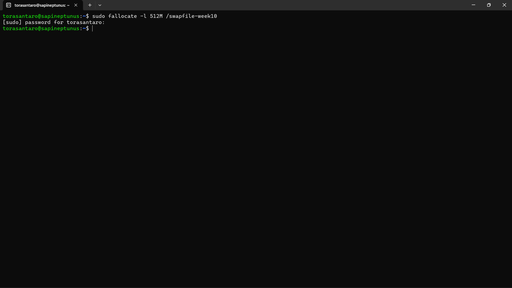

### 2. Atur permission file menjadi `600` — hanya root yang boleh membaca dan menulis.
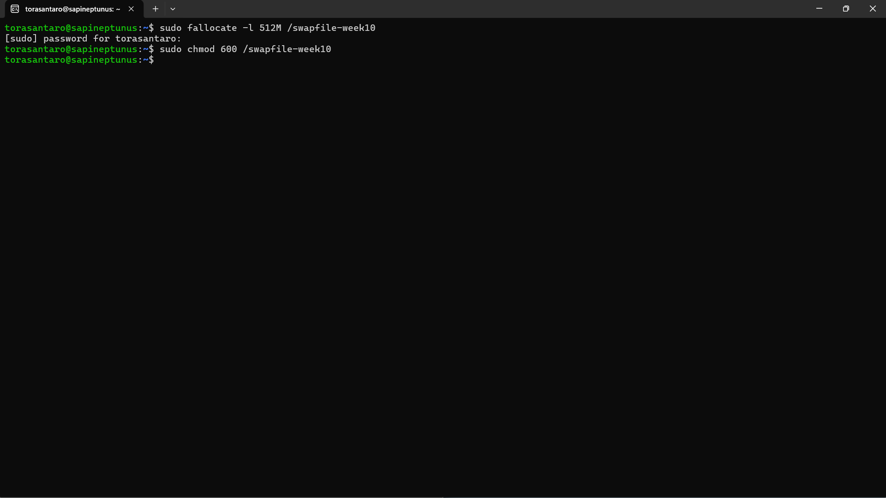

### 3. Format file sebagai area swap, lalu aktifkan.
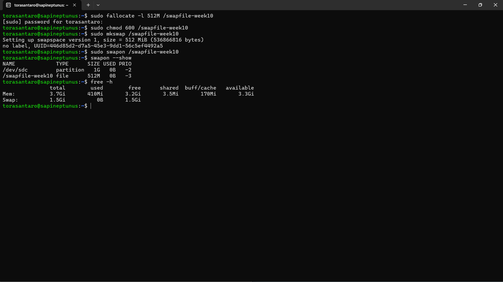

### 4. Verifikasi swap aktif. Anda akan melihat entri `/swapfile-week10` dengan ukuran 512M, dan nilai total pada baris Swap di `free -h` bertambah 512M.

### 5. Periksa nilai `swappiness`, ubah sementara, dan verifikasi perubahan.
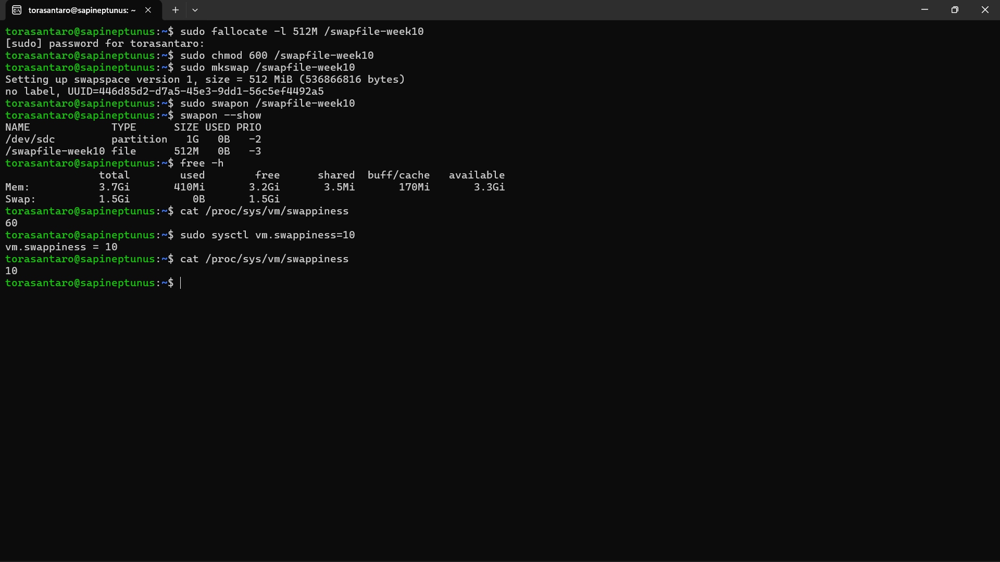

## Analisis 10.3

### 1. Berapa nilai `swappiness` default? Apa artinya bagi perilaku kernel dalam menggunakan swap?
Berdasarkan hasil perintah `cat /proc/sys/vm/swappiness` yang pertama, nilai default pada sistem adalah **60**. 
*   **Artinya:** Kernel akan berperilaku cukup agresif dalam memindahkan data dari RAM ke swap. 
*   Kernel akan mulai mencadangkan data yang jarang diakses ke area swap bahkan ketika RAM fisik belum benar-benar habis, dengan tujuan menjaga ketersediaan cache file di RAM guna mempercepat performa sistem secara umum.

### 2. Setelah diubah ke 10, konfirmasi nilai berubah pada output cat kedua. Apa dampak nilai 10 terhadap penggunaan swap dibanding nilai 60?
Setelah menjalankan perintah `sudo sysctl vm.swappiness=10`, nilai pada output `cat` kedua berhasil berubah menjadi **10**.
*   **Dampak dibanding nilai 60:** Dengan nilai **10**, kernel akan menjadi jauh lebih pasif dan enggan menggunakan swap. 
*   Kernel akan memprioritaskan penggunaan RAM fisik semaksimal mungkin dan hanya akan memindahkan data ke swap jika kapasitas RAM benar-benar berada dalam kondisi kritis atau sangat terpaksa. 
*   Pengaturan ini umumnya meningkatkan performa aplikasi karena meminimalkan akses ke disk (swap) yang kecepatannya jauh lebih lambat daripada RAM.

### 3. Apakah entri `/swapfile-week10` muncul di `swapon –show`? Jika tidak, pastikan Langkah 2 (`chmod 600`) sudah dijalankan sebelum Langkah 3.
Entri `/swapfile-week10` berhasil muncul pada output perintah `swapon --show` dengan informasi sebagai berikut:
*   **TYPE:** file
*   **SIZE:** 512M
*   **USED:** 0B
*   **PRIO:** -3

Munculnya entri ini mengonfirmasi bahwa seluruh tahapan praktikum telah dijalankan dengan benar, termasuk langkah **Langkah 2** (`sudo chmod 600`) yang sangat krusial. Jika izin akses tidak diatur ke `600`, perintah `swapon` biasanya akan ditolak oleh sistem karena alasan keamanan, mengingat file swap dapat berisi data sensitif dari memori proses.

## Praktikum 10.4 — Monitoring Memory

### 1. Ambil snapshot proses diurutkan dari penggunaan memori terbesar.
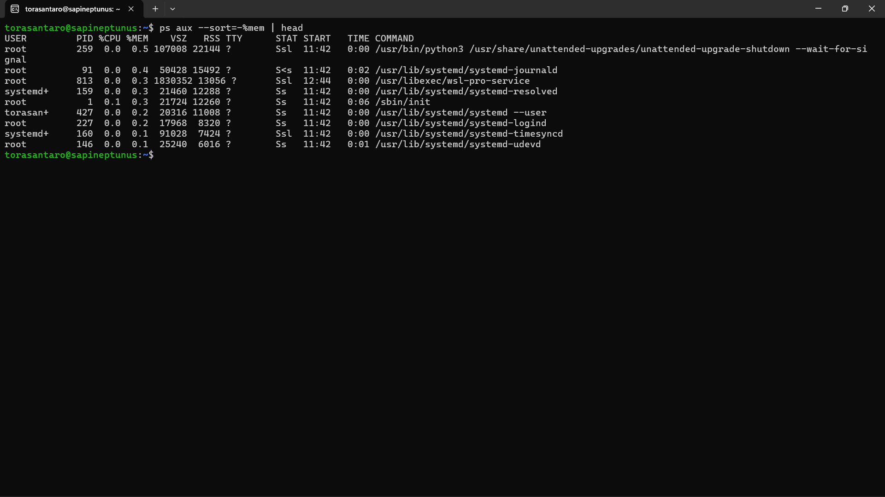     

### 2. Pantau secara real-time dengan `top`.
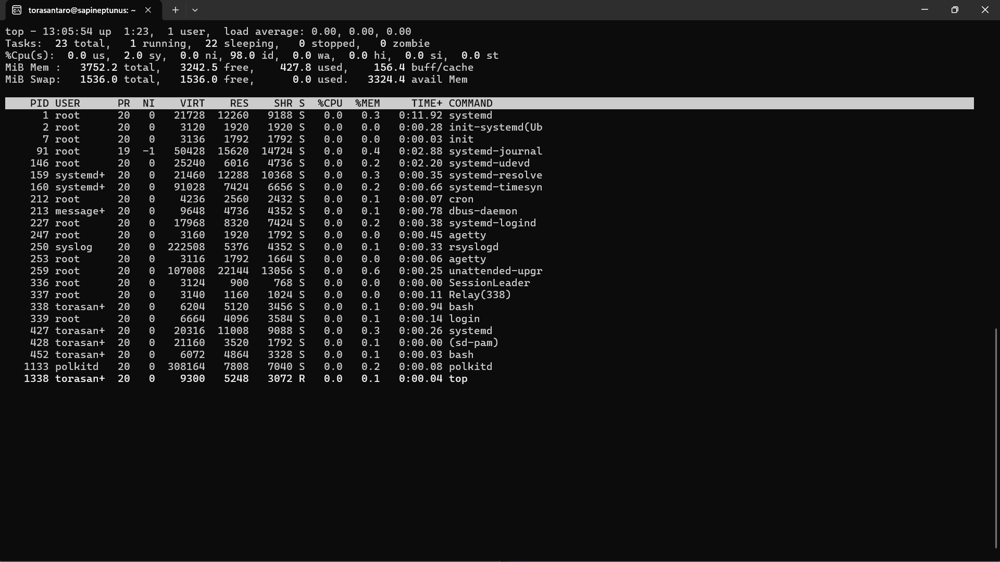

## Analisis 10.4

### 1. Proses apa yang berada di urutan pertama? Catat nilai `%MEM` dan `RSS`-nya.
Berdasarkan output perintah `ps aux --sort=-%mem | head`, proses yang menempati urutan pertama (setelah baris header) adalah:
*   **COMMAND:** `/usr/bin/python3 /usr/share/unattended-upgrades/unattended-upgrade-shutdown`
*   **PID:** 259
*   **%MEM:** 0.6% (Catatan: Pada screenshot `top`, nilai ini terbaca 0.6%, sementara pada `ps` terbaca 0.5% karena perbedaan waktu pengambilan sampel snaphot).
*   **RSS:** 22144 KB

### 2. Konversikan `RSS` dari KB ke MB (bagi 1024). Misalnya, `RSS=524288` berarti proses menggunakan 512 MB RAM. Apakah wajar untuk jenis program tersebut?
Nilai **RSS** proses tersebut adalah **22144 KB**.
*   **Perhitungan:** $22144 / 1024 = 21.625$ MB.
*   **Analisis Kewajaran:** Penggunaan memori sebesar ~21.6 MB untuk sebuah skrip Python sistem (`unattended-upgrades`) adalah **Sangat Wajar**. Program berbasis Python biasanya membutuhkan alokasi memori dasar untuk *interpreter* dan *library* standar sebelum menjalankan fungsinya.

### 3. Mengapa VSZ selalu lebih besar dari `RSS` pada proses yang sama?
Berdasarkan data pada tabel (misalnya PID 259: VSZ = 107008 KB, RSS = 22144 KB), nilai **VSZ** (*Virtual Memory Size*) selalu lebih besar karena:
*   **VSZ** mencakup seluruh ruang alamat yang dipesan oleh proses, termasuk *shared library* yang dimuat di memori, bagian program yang ada di *swap*, serta alokasi memori yang sudah dipesan tetapi belum benar-benar digunakan.
*   **RSS** (*Resident Set Size*) hanya menghitung bagian dari proses yang **benar-benar berada di dalam RAM fisik** saat ini.

### 4. Apakah urutan proses di ps konsisten dengan tampilan `top` saat diurutkan berdasarkan `%MEM`?
Secara umum, urutan proses antara `ps aux --sort=-%mem` dan tampilan `top` (setelah ditekan `M`) adalah **Konsisten**.
*   Pada kedua gambar, proses dengan **PID 259** tetap konsisten berada di urutan teratas sebagai pengguna memori terbesar.
*   Perbedaan kecil pada nilai angka atau posisi proses di urutan bawah (setelah urutan pertama) adalah wajar karena `top` bersifat *real-time* (dinamis), sedangkan `ps` bersifat *snapshot* (statis pada satu titik waktu). Saat pengambilan gambar dilakukan, aktivitas sistem mungkin mengalami sedikit perubahan.

## Praktikum 10.5 — Script Monitor Memori

### 1. Masuk ke direktori kerja dan buat file script:
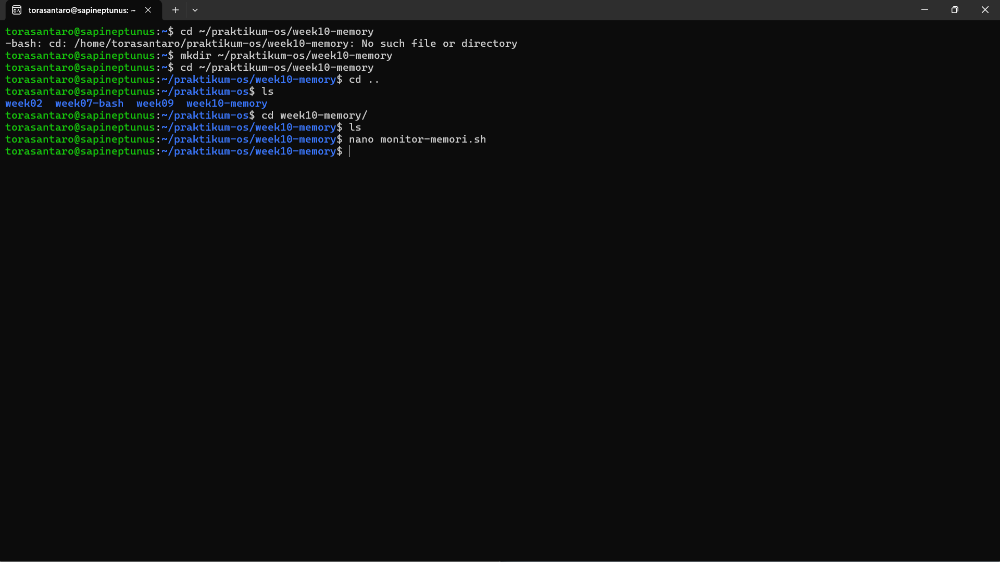
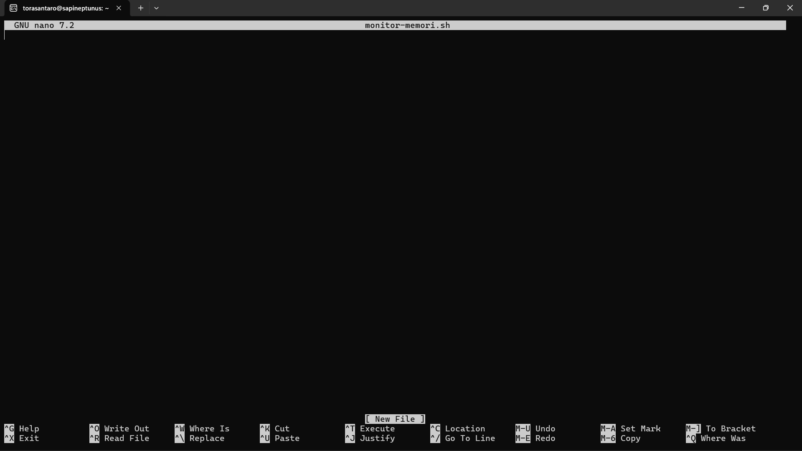

### 2. Ketik isi berikut:
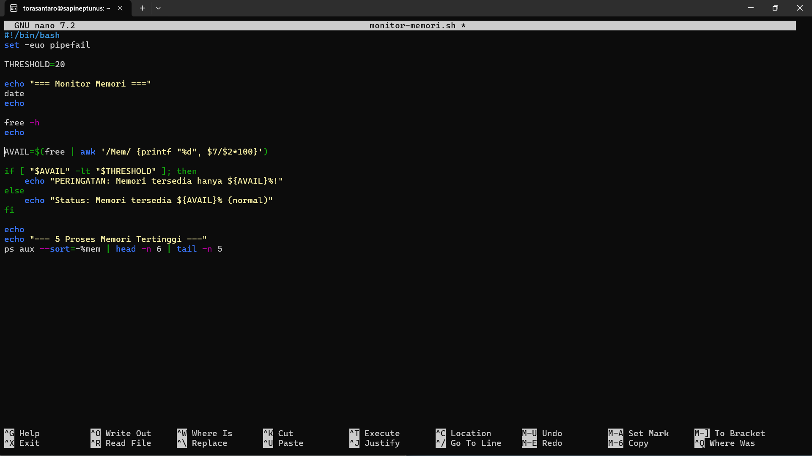
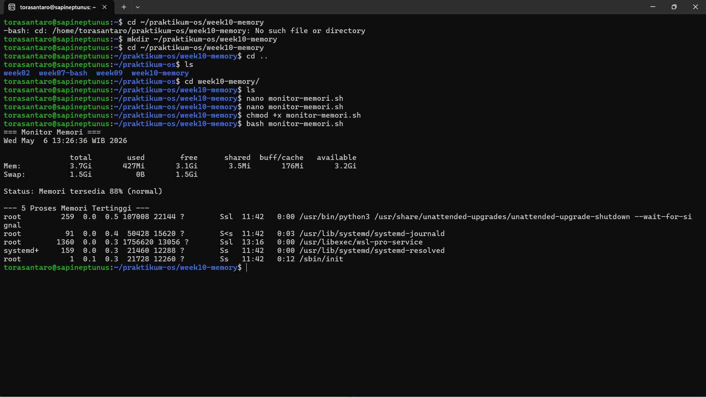

## Analisis 10.5

### 1. Variabel `THRESHOLD=20` menetapkan batas persentase. Perintah `free | awk ’/Mem/ {printf "%d", $7/$2*100}`’ mengambil kolom ke-7 (available) dibagi kolom ke-2 (total) dari baris Mem, lalu dikalikan 100 untuk menghasilkan persentase bilangan bulat.
Perintah `free | awk '/Mem/ {printf "%d", $7/$2*100}'` berfungsi untuk menghitung rasio ketersediaan memori secara otomatis:
* **`awk '/Mem/'`**: Memfilter output perintah `free` agar hanya mengambil baris yang berisi informasi RAM fisik.
* **`$7/$2`**: Membagi nilai pada kolom ke-7 (*available*) dengan kolom ke-2 (*total*).
* **`*100`**: Mengalikan hasil pembagian dengan 100 untuk mendapatkan format persentase.
* **`printf "%d"`**: Memformat hasil perhitungan menjadi bilangan bulat tanpa desimal agar dapat diproses oleh struktur logika `if` pada Bash.

### 2. Kondisi `if [ "$AVAIL" -lt "$THRESHOLD" ]` bernilai benar jika persentase memori tersedia di bawah 20.
Kondisi `if [ "$AVAIL" -lt "$THRESHOLD" ]` menggunakan operator `-lt` (*less than*) untuk membandingkan persentase memori yang tersedia dengan batas yang telah ditentukan. 
* Berdasarkan screenshot eksekusi script, nilai `$AVAIL` saat ini adalah **88%**.
* Karena **88** tidak lebih kecil dari **20**, maka kondisi bernilai **salah (false)** dan sistem menjalankan blok `else`, sehingga menampilkan output: `Status: Memori tersedia 88% (normal)`.

### 3. Ubah `THRESHOLD` menjadi `90` dan jalankan ulang. Apa yang berubah pada output? Mengapa demikian?
Jika variabel `THRESHOLD` diubah nilainya menjadi **90** dan script dijalankan kembali:
* **Perubahan pada Output:** Output akan berubah menjadi **PERINGATAN: Memori tersedia hanya 88%!**.
* **Mengapa Demikian?** Hal ini terjadi karena nilai memori tersedia saat ini (88%) lebih kecil daripada ambang batas baru (90). Secara logika, kondisi `88 < 90` bernilai **benar (true)**, sehingga script secara otomatis memicu blok perintah peringatan meskipun secara teknis sistem masih memiliki sisa RAM yang sangat banyak.

## Praktikum 10.6 — Mengamati System Call dengan `strace`

### 1. Mengamati System Call dengan `strace`
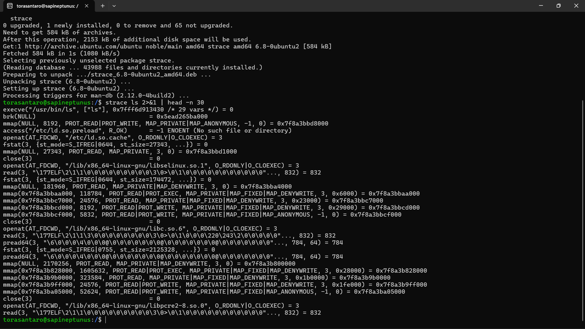

### 2. Lihat ringkasan statistik dan bandingkan dua direktori berbeda.
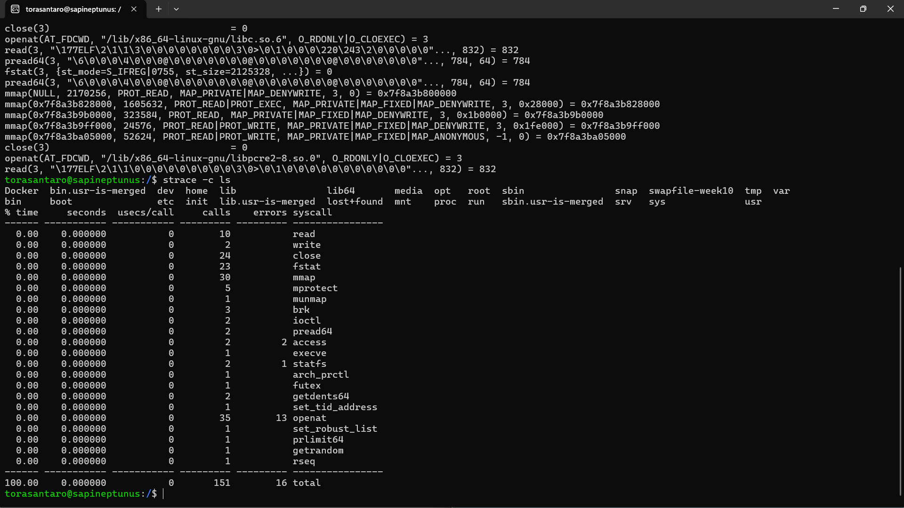
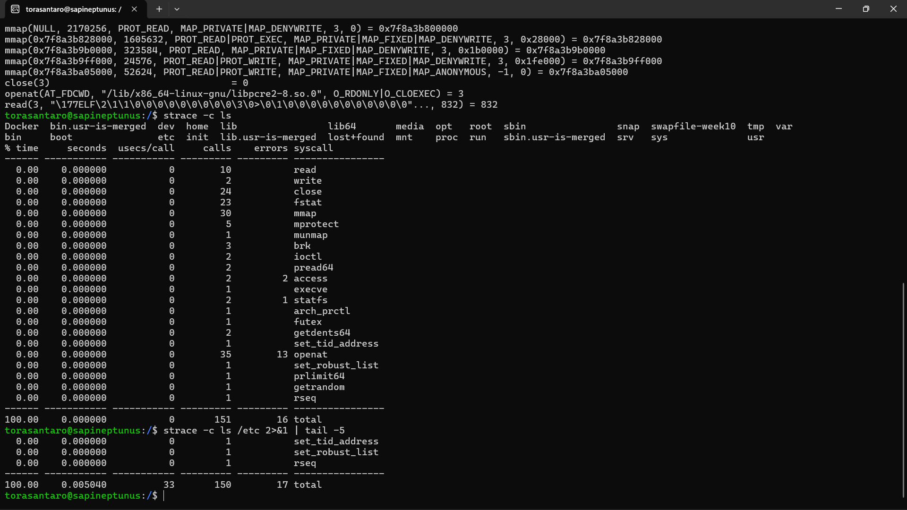

## Analisis 10.6

### 1. Dari output Langkah 1, identifikasi minimal 4 system call berbeda. Jelaskan fungsi singkat masing-masing berdasarkan argumen yang terlihat.
Berdasarkan output `strace ls` pada Langkah 1, berikut adalah 4 *system call* yang teridentifikasi beserta fungsinya:
*   **`execve`**: Digunakan untuk mengeksekusi program (dalam hal ini `/usr/bin/ls`). Argumen yang terlihat mencakup jalur file, argumen perintah `["ls"]`, dan variabel lingkungan.
*   **`openat`**: Digunakan untuk membuka file atau direktori. Terlihat membuka file sistem seperti `/etc/ld.so.cache` dan *library* pendukung dengan mode `O_RDONLY` (hanya baca).
*   **`mmap`**: Berfungsi untuk memetakan file atau perangkat ke dalam memori. Digunakan oleh `ls` untuk memuat *library* ke dalam ruang alamat memori proses.
*   **`fstat`**: Digunakan untuk mendapatkan status atau metadata file (seperti ukuran file dan izin akses) melalui *file descriptor* yang sudah terbuka.

### 2. Dari ringkasan `strace -c`, system call mana yang paling sering dipanggil? Mengapa?
Berdasarkan ringkasan dari perintah `strace -c ls`, *system call* yang paling sering dipanggil adalah **`openat`** dengan total **35 kali pemanggilan**.
*   **Mengapa?** Hal ini dikarenakan perintah `ls` perlu membuka banyak file *library* pendukung (`.so`) dan file konfigurasi sistem agar program dapat berjalan dengan benar, serta membuka direktori target untuk membaca isinya.

### 3. Apakah ada system call dengan `errors` lebih dari `0`? Apakah itu berarti program bermasalah, ataukah bagian normal dari logika program?
Ya, terdapat *system call* dengan jumlah `errors` lebih dari 0, contohnya:
*   **`openat`**: Memiliki **13 errors**.
*   **`access`**: Memiliki **2 errors**.

**Analisis:** Hal ini **bukan berarti program bermasalah**, melainkan bagian normal dari logika program. Misalnya, program mencoba mencari file konfigurasi di beberapa lokasi berbeda (seperti `/etc/ld.so.preload`). Jika file tidak ditemukan (error `ENOENT`), program akan melanjutkan ke lokasi pencarian berikutnya tanpa mengalami kegagalan proses.

### 4. Apakah jumlah system call berbeda antara `ls` dan `ls /etc?` Faktor apa yang menyebabkan perbedaan tersebut?
Berdasarkan ringkasan statistik (kolom `total` di bagian bawah):
*   **`ls`**: Melakukan total **151** pemanggilan *system call*.
*   **`ls /etc`**: Melakukan total **150** pemanggilan *system call* (berdasarkan snapshot terminal terakhir Anda).

**Faktor Penyebab Perbedaan:**
Meskipun pada percobaan Anda jumlahnya sangat mirip (bahkan berkurang 1), secara teoritis jumlah *system call* dipengaruhi oleh:
*   **Jumlah Entri**: Direktori `/etc` memiliki lebih banyak file dibandingkan direktori kerja saat ini, sehingga membutuhkan lebih banyak panggilan `getdents64` untuk membaca isi direktori.
*   **Metadata**: Jika menggunakan opsi tambahan (seperti `-l`), sistem akan memanggil `newfstatat` untuk setiap file yang ada di direktori tersebut.
*   **Kondisi Lingkungan**: Perbedaan kecil dapat terjadi tergantung pada *cache* sistem atau file spesifik yang coba diakses oleh program saat memuat *library*.

## Instruksi Umum: Kerjakan seluruh tugas pada direktori berikut.
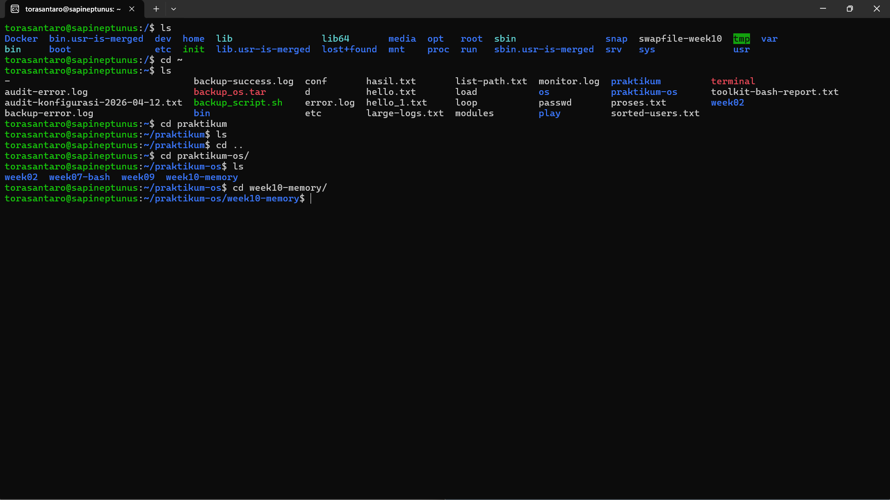

## Tugas Praktikum 1 — Audit Penggunaan Memori Sistem

### Instruksi: Buat script `memory-audit.sh` yang menghasilkan laporan kondisi memori sistem secara otomatis.

### Proses Pengerjaan Tugas:

### Pembuatan Script `memory-audit.sh`
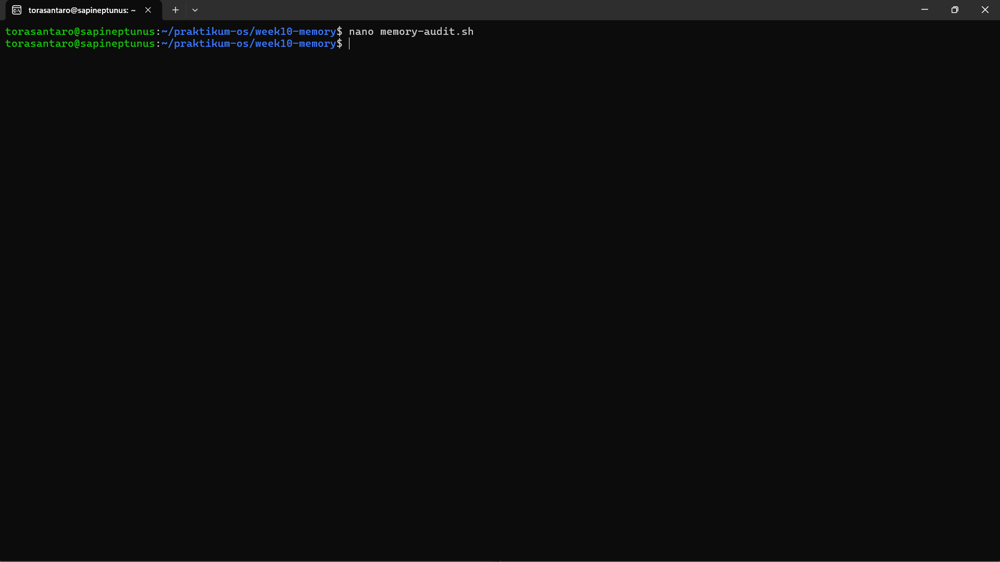
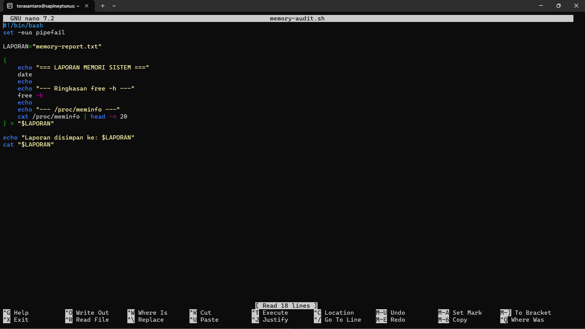

### Menjalankan Script
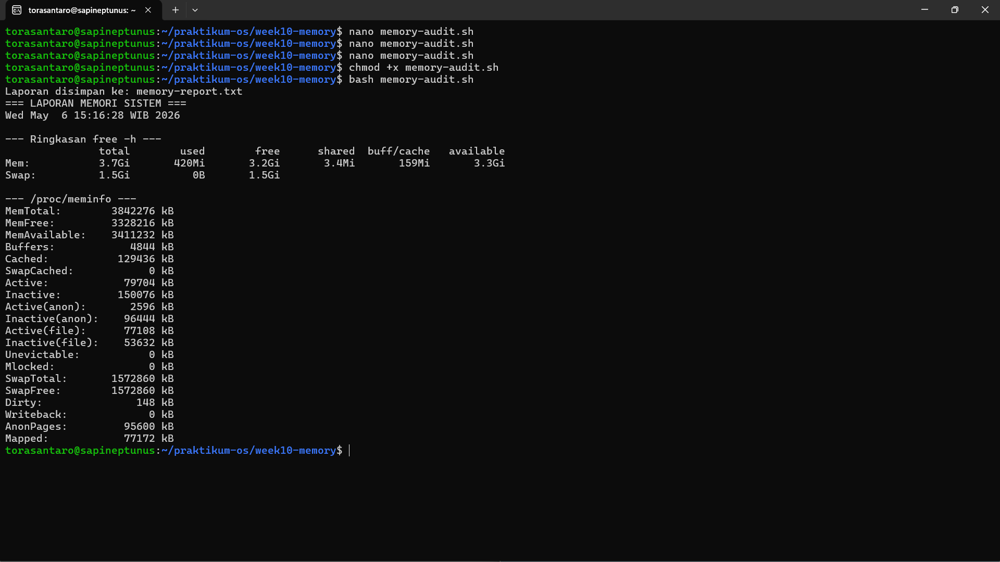

### Analisis:

### 1. Hitung persentase memori tersedia (available / total × 100%). Apakah sistem dalam kondisi normal?
Berdasarkan data yang dihasilkan oleh script `memory-audit.sh` pada terminal:
* **Total Memori (total):** 3.7 GiB
* **Memori Tersedia (available):** 3.3 GiB

**Perhitungan:**
$$\frac{\text{Available}}{\text{Total}} \times 100\%$$
$$\frac{3.3}{3.7} \times 100\% = 89.18\%$$

**Kesimpulan:** 
Sistem saat ini berada dalam kondisi **Sangat Normal**. Karena persentase memori tersedia (~89%) jauh di atas ambang batas kritis 10%, sistem memiliki ruang yang sangat luas untuk menjalankan beban kerja aplikasi baru tanpa risiko kekurangan memori.

### 2. Mengapa `buff/cache` tidak dihitung sebagai memori yang terpakai dari sudut pandang ketersediaan untuk aplikasi?
Kategori `buff/cache` (tercatat sebesar 159 MiB pada laporan) tidak dihitung sebagai memori yang "terpakai" (used) oleh aplikasi karena:
* **Fungsi:** Linux menggunakan RAM yang menganggur sebagai buffer I/O dan cache file untuk mempercepat akses data ke disk.
* **Sifat Reclaimable:** Memori ini bersifat *reclaimable*, artinya kernel Linux dapat segera membebaskan atau mengambil kembali memori tersebut secara otomatis jika ada aplikasi yang meminta alokasi RAM baru.
* **Ketersediaan:** Oleh karena itu, meskipun secara fisik terisi data, memori ini tetap dianggap "tersedia" untuk aplikasi kapan pun dibutuhkan.

### 3. Dari `/proc/meminfo`, apakah `SwapTotal` lebih besar dari 0? Berapa nilai `SwapFree`?
Berdasarkan data detail pada bagian `/proc/meminfo`:
* **SwapTotal:** Nilainya adalah **1.572.860 kB** (atau sekitar 1.5 GiB). Karena nilainya lebih besar dari 0, ini menandakan bahwa sistem memiliki area swap yang aktif.
* **SwapFree:** Nilainya adalah **1.572.860 kB**.

**Analisis:**
Karena nilai `SwapTotal` sama persis dengan nilai `SwapFree`, hal ini berarti **tidak ada memori swap yang sedang digunakan (Used = 0)**. Sistem memiliki "jaring pengaman" sebesar 1.5 GiB, namun belum perlu menggunakannya karena kapasitas RAM fisik (3.7 GiB) masih sangat mencukupi untuk menangani proses yang ada.

## Tugas Praktikum 2 — Identifikasi Proses dengan Memori Tertinggi

### Instruksi: Simpan daftar 10 proses pengguna memori terbesar ke file.
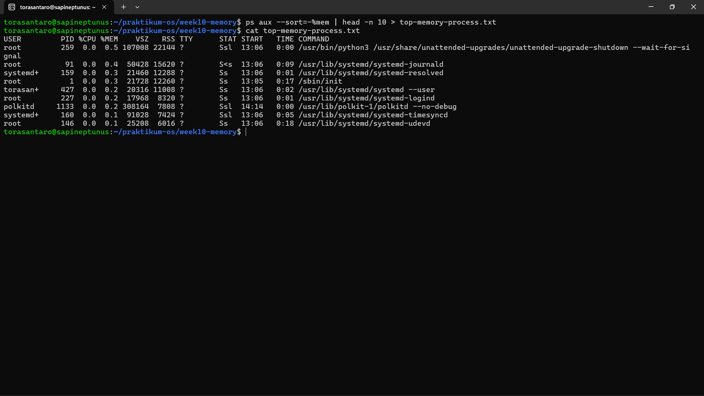

### Analisis:

### 1. Proses apa di urutan pertama? Catat nilai `%MEM` dan `RSS`.
Berdasarkan data yang tercatat dalam file `top-memory-process.txt`, proses yang menempati urutan pertama adalah:
*   **COMMAND**: `/usr/bin/python3 /usr/share/unattended-upgrades/unattended-upgrade-shutdown`
*   **PID**: 259
*   **%MEM**: 0.5%
*   **RSS**: 22144

### 2. Konversikan `RSS` ke MB (bagi 1024). Apakah wajar?
Nilai **RSS** (*Resident Set Size*) dari proses teratas adalah **22144 KB**.
*   **Perhitungan**: $$22144 / 1024 = 21.625 \text{ MB}$$
*   **Analisis Kewajaran**: Penggunaan memori sebesar **21.6 MB** untuk sebuah skrip Python sistem (`unattended-upgrades`) adalah **sangat wajar**. Hal ini dikarenakan proses tersebut memerlukan alokasi memori dasar untuk memuat *interpreter* Python dan pustaka sistem standar agar dapat menjalankan fungsinya di latar belakang.

### 3. Jumlahkan `%MEM` dari 5 proses teratas. Berapa persen RAM yang mereka gunakan bersama?
Berikut adalah rincian penggunaan RAM dari lima proses dengan konsumsi memori tertinggi:
1.  **Proses 1 (PID 259)**: 0.5%
2.  **Proses 2 (PID 91)**: 0.4%
3.  **Proses 3 (PID 159)**: 0.3%
4.  **Proses 4 (PID 1)**: 0.3%
5.  **Proses 5 (PID 427)**: 0.2%

**Total Penggunaan Bersama**:
$$0.5\% + 0.4\% + 0.3\% + 0.3\% + 0.2\% = 1.7\%$$

**Analisis**: Kelima proses sistem yang paling "berat" tersebut hanya menggunakan total **1.7%** dari keseluruhan kapasitas RAM fisik. Hal ini mengindikasikan bahwa kondisi sistem saat ini sangat efisien dan beban kerja yang berjalan sangat ringan bagi spesifikasi perangkat keras yang digunakan.

## Tugas Praktikum 3 — Membuat dan Memverifikasi Swap File

### Instruksi: Buat swap file khusus tugas sebesar 256 MB dan verifikasi.
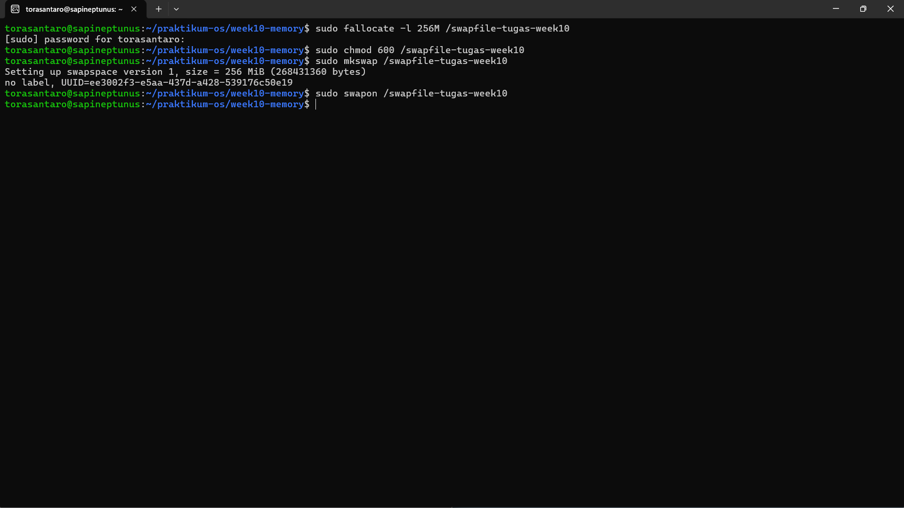
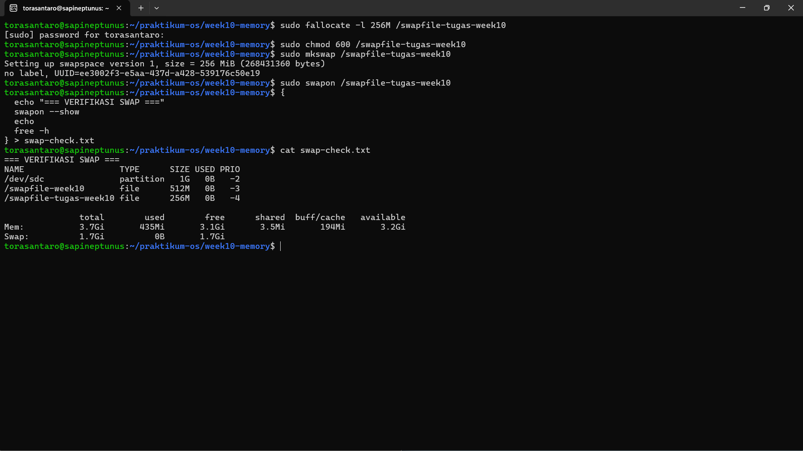

### Analisis:

### 1. Identifikasi kolom `NAME`, `TYPE`, `SIZE`, dan `USED` pada output `swapon -show`.
Berdasarkan output dari file `swap-check.txt` yang kamu tampilkan, berikut adalah identifikasi kolom-kolom tersebut:
*   **NAME**: Menunjukkan lokasi atau jalur file/partisi yang digunakan sebagai swap. Pada gambar terlihat ada tiga entri: `/dev/sdc`, `/swapfile-week10`, dan `/swapfile-tugas-week10`.
*   **TYPE**: Menunjukkan jenis area swap. Entri `/dev/sdc` bertipe **partition**, sedangkan `/swapfile-week10` dan `/swapfile-tugas-week10` bertipe **file**.
*   **SIZE**: Menunjukkan kapasitas total masing-masing area swap. `/swapfile-tugas-week10` tercatat sebesar **256M**.
*   **USED**: Menunjukkan jumlah ruang swap yang sedang digunakan oleh sistem. Pada gambar, nilai untuk semua entri adalah **0B**, yang berarti belum ada data yang dipindahkan ke swap.

### 2. Apakah nilai total pada baris `Swap` di `free -h` bertambah 256 MB?
Ya, nilai total pada baris **Swap** di perintah `free -h` telah bertambah. 
*   Sebelum penambahan file tugas ini (berdasarkan praktikum sebelumnya), total swap sistem adalah **1.5 GiB**. 
*   Setelah menjalankan `swapon` untuk file sebesar 256 MiB, total swap pada baris terakhir gambar kini terbaca menjadi **1.7 GiB**. Hal ini membuktikan bahwa penambahan swap sebesar 256 MB berhasil diintegrasikan oleh kernel.

### 3. Mengapa permission `600` penting? Apa risiko jika diatur ke `644`?
Pengaturan izin akses (permission) ke `600` sangat krusial karena alasan keamanan data:
*   **Pentingnya `600`**: File swap bertindak sebagai perpanjangan dari RAM, yang berarti file tersebut menyimpan potongan data aktif dari memori program, termasuk informasi sensitif seperti *password*, kunci enkripsi, atau data pribadi lainnya. Izin `600` memastikan bahwa **hanya pengguna root** yang memiliki akses untuk membaca atau menulis file tersebut.
*   **Risiko jika `644`**: Jika diatur ke `644` (global read), maka pengguna lain yang masuk ke sistem yang sama dapat membaca isi file swap tersebut. Hal ini memungkinkan adanya pencurian data sensitif yang seharusnya terisolasi di dalam memori proses, sehingga menciptakan celah keamanan yang serius.

## Tugas Praktikum 4 — Analisis System Call dengan `strace`

### Instruksi: Analisis system call yang dipanggil perintah `ls`.
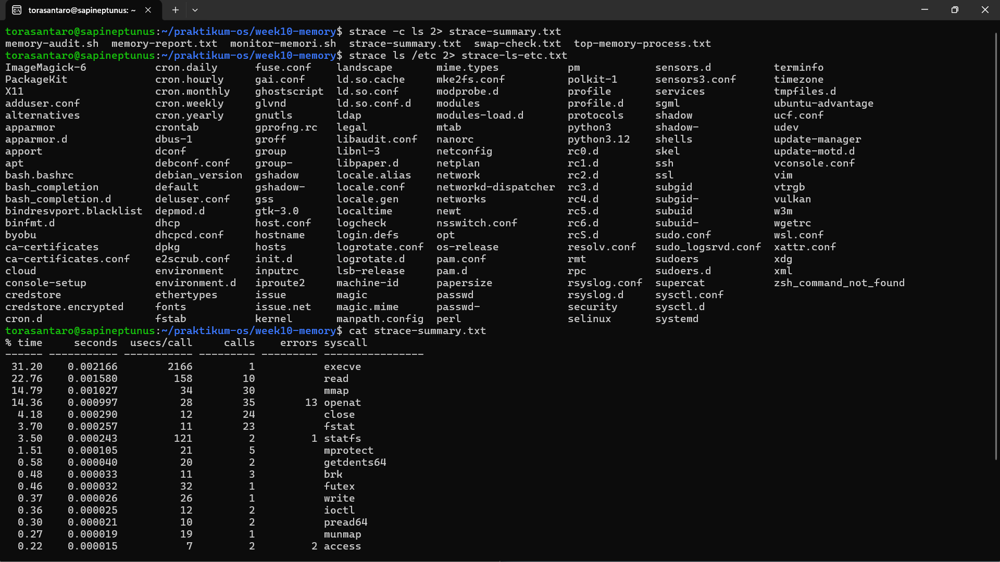
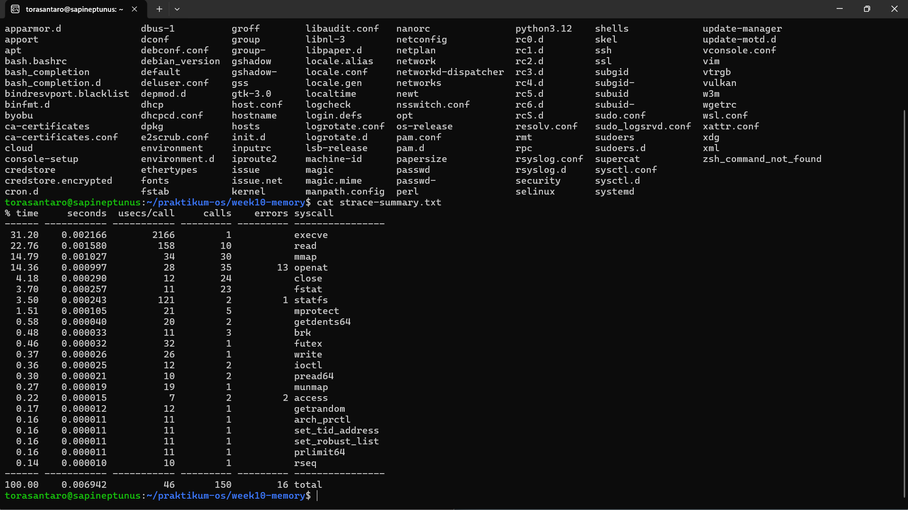

### Analisis:

### 1. Sebutkan minimal 5 system call dari `strace-summary.txt` beserta fungsi singkatnya.
Berdasarkan data yang tercatat dalam `strace-summary.txt`, berikut adalah 5 *system call* yang digunakan beserta fungsi singkatnya:
*   **`execve`**: Digunakan untuk mengeksekusi atau menjalankan program (dalam hal ini `/usr/bin/ls`).
*   **`read`**: Berfungsi untuk membaca data dari sebuah *file descriptor* yang telah dibuka.
*   **`mmap`**: Digunakan untuk memetakan file atau perangkat ke dalam memori virtual proses, seringkali untuk memuat *library*.
*   **`openat`**: Berfungsi untuk membuka file atau direktori; pada `ls`, ini digunakan untuk membuka direktori target dan file sistem.
*   **`close`**: Digunakan untuk menutup akses pada *file descriptor* yang sudah tidak diperlukan lagi.

### 2. System call mana yang paling sering dipanggil? Mengapa?
Berdasarkan kolom `calls`, *system call* yang paling sering dipanggil adalah **`openat`** dengan total **35 kali** panggilan.
*   **Alasan**: Perintah `ls` perlu membuka banyak file pustaka pendukung (*shared libraries*), file konfigurasi sistem, serta direktori yang ingin dibaca isinya agar program dapat berjalan dan menampilkan data dengan lengkap.

### 3. Apakah ada `errors` lebih dari `0`? Apakah program tetap berjalan normal meskipun ada kegagalan tersebut?
Ya, terdapat beberapa *system call* yang memiliki nilai pada kolom `errors` lebih dari 0, di antaranya:
*   **`openat`**: 13 *errors*.
*   **`access`**: 2 *errors*.
*   **`statfs`**: 1 *error*.

**Analisis**: Meskipun terdapat kegagalan (errors), **program tetap berjalan dengan normal**. Kegagalan ini biasanya merupakan bagian dari logika normal program; misalnya, program mencoba mengecek keberadaan file konfigurasi di lokasi tertentu yang mungkin tidak ada, lalu melanjutkan pencarian ke lokasi alternatif jika mendapatkan pesan error (seperti `ENOENT`). Selama kebutuhan utama program terpenuhi, proses tidak akan terhenti.

## Tugas Praktikum 5 — Studi Kasus Diagnosa Server Lambat

### Instruksi: Server terasa lambat. Buat script diagnosa yang menggabungkan semua pemeriksaan dari bab ini menggunakan fungsi `Bash`.
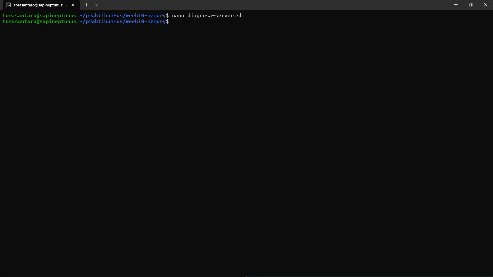
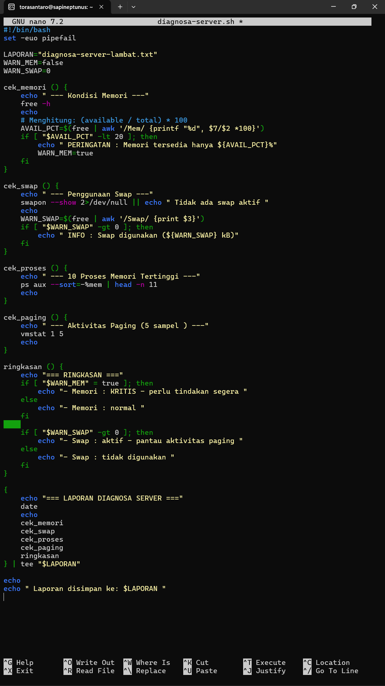
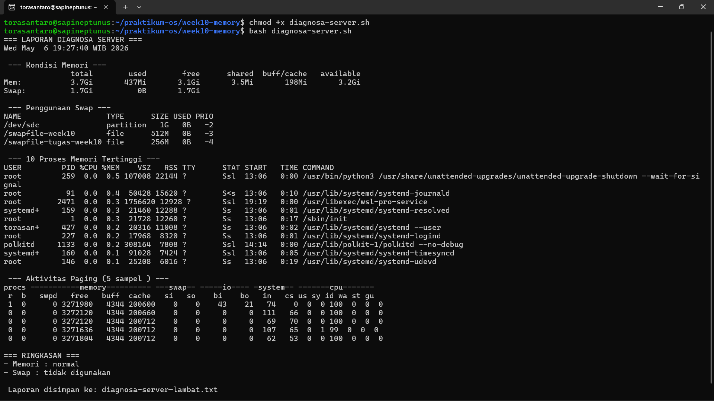

### Analisis:

### 1. Jelaskan peran masing-masing fungsi: `cek_memori`, `cek_swap`, `cek_proses`, `cek_paging`, dan `ringkasan`. Mengapa diagnosa dipecah menjadi fungsi terpisah?
Script ini dipecah menjadi beberapa fungsi spesifik untuk menjaga **modularitas** dan **keterbacaan** kode:
*   **`cek_memori`**: Mengambil data RAM fisik dan menghitung persentase ketersediaan untuk mendeteksi potensi *out-of-memory*.
*   **`cek_swap`**: Memeriksa apakah memori virtual (swap) aktif dan seberapa besar beban yang dialihkan ke disk.
*   **`cek_proses`**: Mengidentifikasi 10 aplikasi atau layanan yang paling boros RAM untuk mempermudah investigasi penyebab kelambatan.
*   **`cek_paging`**: Memantau lalu lintas data antara RAM dan swap secara *real-time*.
*   **`ringkasan`**: Mengagregasi semua temuan menjadi kesimpulan akhir (Normal/Kritis) agar administrator tidak perlu membaca seluruh log secara manual.
*   **Alasan Pemisahan**: Dengan memisahkan diagnosa menjadi fungsi, script menjadi lebih mudah dipelihara (*maintainable*). Kita bisa memperbarui logika pengecekan memori tanpa mengganggu fungsi pengecekan proses lainnya.

### 2. Berdasarkan bagian `RINGKASAN`, apakah kondisi sistem normal atau kritis? Jelaskan berdasarkan nilai threshold yang digunakan script.
Berdasarkan bagian `RINGKASAN` pada output terminal, kondisi sistem adalah **Normal**.
*   **Analisis Nilai**: Script menggunakan *threshold* ketersediaan memori sebesar **20%**.
*   **Perhitungan**: Dari data `free -h`, memori tersedia adalah **3.2 GiB** dari total **3.7 GiB**.
    $$\text{Persentase Tersedia} = \left( \frac{3.2}{3.7} \right) \times 100 \approx 86.49\%$$
*   **Kesimpulan**: Karena $86.49\% > 20\%$, sistem tidak memicu peringatan kritis dan tetap berada dalam status operasional yang aman.

### 3. Mengapa script menggunakan `tee "$LAPORAN"` bukan `redirection biasa > "$LAPORAN"`? Apa keuntungannya?
Script menggunakan perintah `| tee "$LAPORAN"` alih-alih pengalihan standar `>` karena fitur **dual-output** yang dimilikinya:
*   **Keuntungan Utama**: Perintah `tee` mengirimkan data ke dua tempat sekaligus: ke layar terminal (*Standard Output*) dan ke file teks laporan.
*   **Efisiensi Diagnosa**: Hal ini memungkinkan kamu sebagai administrator untuk memantau proses diagnosa secara langsung (*real-time*) di layar tanpa harus menunggu script selesai dan membuka file laporan secara manual.

### 4. Dari output `cek_paging`, apakah ada aktivitas `si` atau `so`? Jika ada, apa implikasinya terhadap performa server?
Berdasarkan output dari fungsi `cek_paging` (data `vmstat 1 5` pada gambar):
*   **Hasil Pengamatan**: Nilai pada kolom **`si`** (*swap-in*) dan **`so`** (*swap-out*) semuanya adalah **0**.
*   **Implikasi Performa**: Hal ini menunjukkan performa server sangat optimal. Nilai **0** pada `si/so` berarti tidak ada aktivitas pertukaran data antara RAM dan disk (paging). Sistem sepenuhnya bekerja di dalam RAM fisik yang jauh lebih cepat daripada disk, sehingga tidak ada pelambatan yang disebabkan oleh fenomena *disk thrashing*.
