# PERTEMUAN 6

## Praktikum 6.1

### Tampilkan semua proses yang berjalan:

### Tampilkan proses beserta thread-nya, dapat dilihat pada kolom LWP (Light-Weight Process ID):

### Lihat PID shell aktif dan detail prosesnya:

### Lihat hierarki proses secara visual:

## Latihan 6.1
**Jalankan `ps aux` dan amati output nya:**
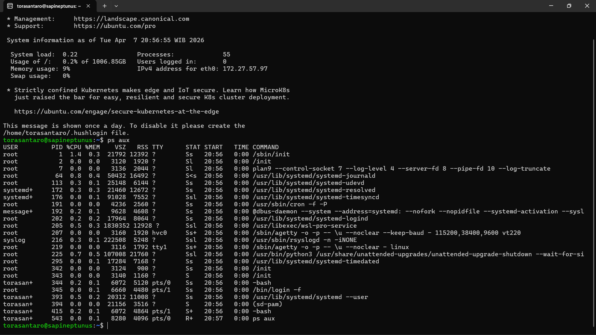

1. Berapa total proses yang berjalan? Proses apa yang memiliki PID terkecil?
    total proses yang berjalan adalah 24 proses dan proses yang memiliki PID terkecil (1) adalah proses pada baris pertama yaitu `root           1  1.4  0.3  21792 12392 ?        Ss   20:56   0:00 /sbin/init`

2. Jalankan `pstree -p` dan temukan proses bash Anda. Proses apa yang menjadi induk (PPID) dari bash tersebut?
    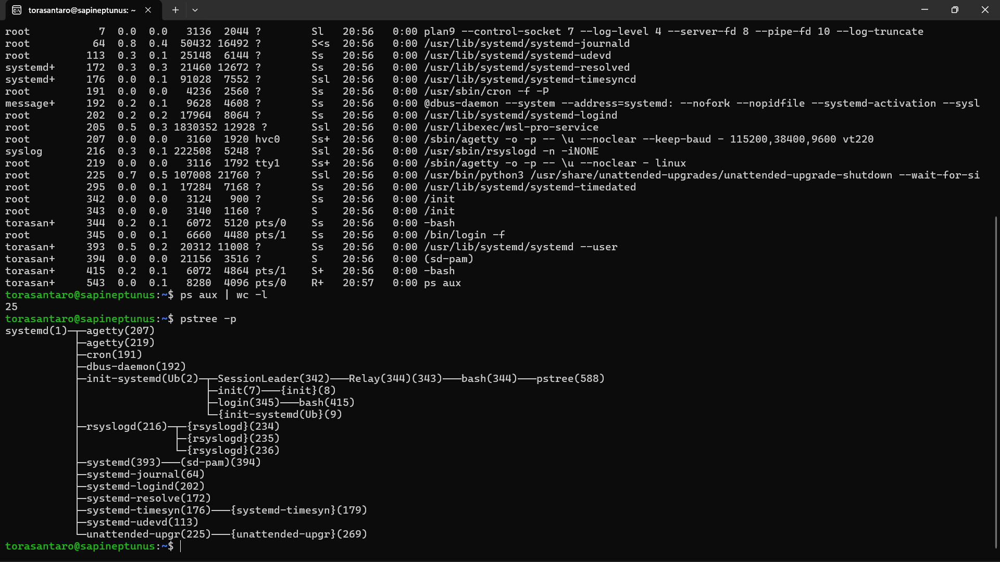
    Terdapat 2 proses bash yaitu bash(344) dan bash(415). Untuk bash(344), proses yang menjadi induknya (PPID) adalah Relay(344)(343). Untuk bash(415), proses yang menjadi induknya (PPID) adalah login(345).

3. Bandingkan output `ps aux` dan `ps aux -L`. Apa perbedaan yang Anda lihat?
    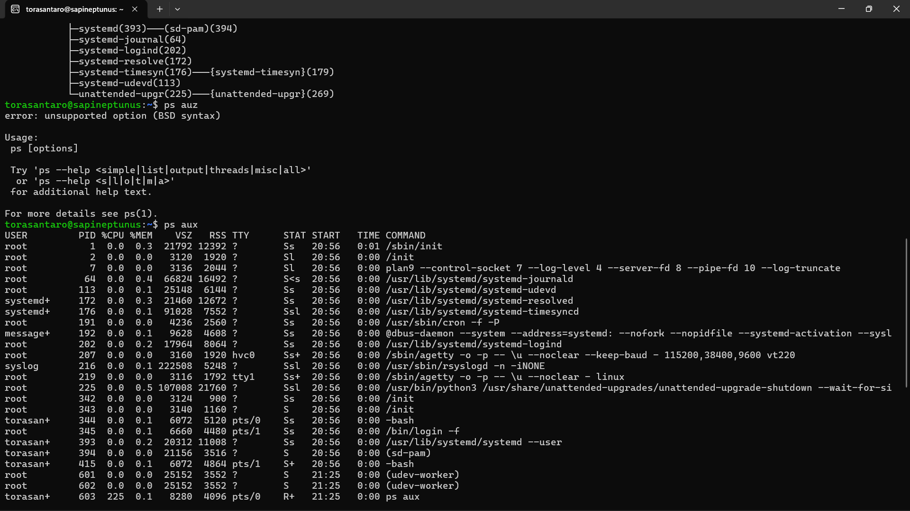
    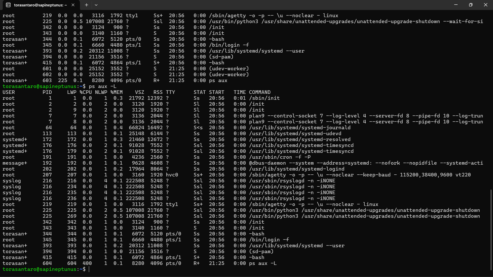

| `ps aux` | `ps aux -L` |
| --- | --- |
| Menampilkan daftar proses secara umum. Satu baris mewakili satu program yang berjalan. | Menampilkan daftar LWP (Light Weight Processes) atau lebih dikenal sebagai Thread. |
| Menghasilkan lebih sedikit baris. | Menghasilkan jauh lebih banyak baris. |
| - | Memunculkan kolom LWP (Light Weight Process ID) atau TID (Thread ID). |

## Praktikum 6.2

### Buat proses di background dan amati kondisinya:

### Amati perubahan exit code dari perintah yang berhasil dan gagal:

## Latihan 6.2
1. Jalankan `sleep 120 &` dan amati kolom STAT pada `ps aux`. Kondisi
apa yang ditampilkan? Mengapa proses sleep berada di kondisi tersebut?
    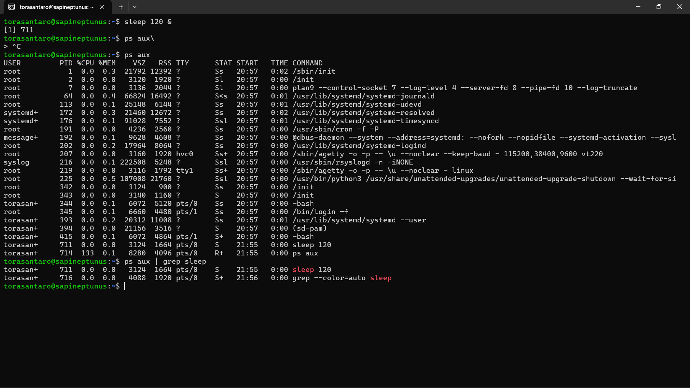
    Kondisi STAT yang ditampilkan adalah `S`. Proses sleep digunakan untuk menunggu waktu tertentu tanpa melakukan aktivitas komputasi apa pun. Jadi, Linux mengubah status nya menjadi Sleeping (S). Dalam kondisi ini, proses tersebut berhenti dan tidak menggunakan siklus CPU, sehingga sumber daya CPU dapat digunakan untuk proses lain yang sedang aktif. Proses ini akan kembali berjalan secara otomatis ketika waktu 120 detik telah habis atau jika menerima sinyal tertentu.

1. Jalankan beberapa perintah yang berhasil dan yang gagal, lalu catat exit
code masing-masing. Pola apa yang Anda temukan?
    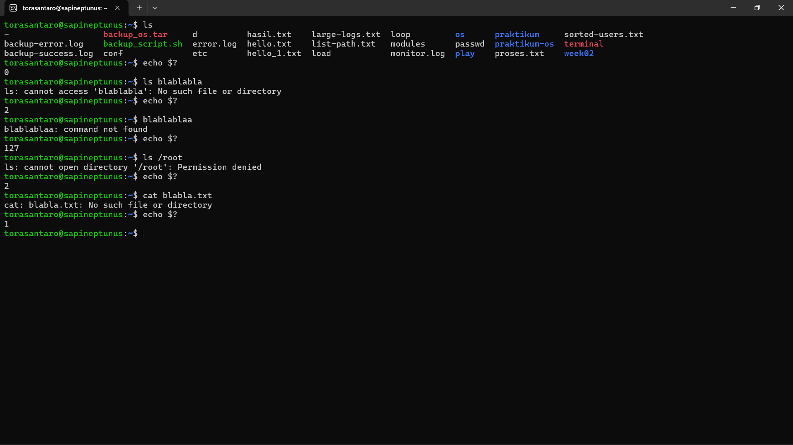

| Perintah | Kondisi | Exit Code (echo $?) | Analisa |
| --- | --- | --- | --- |
| ls | Berhasil | 0 | Perintah sukses menampilkan daftar file dan direktori yang ada. |
| ls /root | Gagal | 2 | Gagal karena masalah izin akses (Permission denied). |
| cat blabla.txt | Gagal | 1 | File x.txt tidak ditemukan di direktori aktif. |
| blablablaa | Gagal | 127 | Perintah tidak dikenal oleh shell. |

## Praktikum 6.3

### Jalankan proses dengan prioritas rendah:

### Verifikasi nilai nice pada kolom NI:

### Ubah nilai nice proses yang sudah berjalan:

### Bersihkan proses percobaan:

## Latihan 6.3
1. Jalankan `nice -n 5 sleep 200 &` dan verifikasi nilai NI-nya dengan `ps`.
    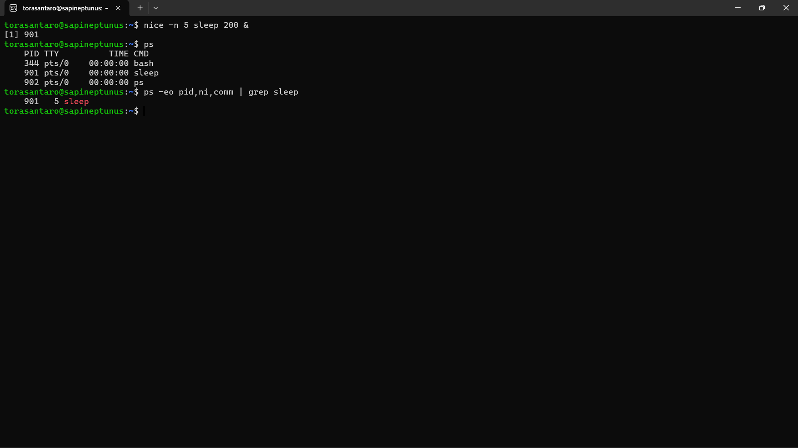
    Nilai NI pada proses tersebut adalah 5.

2. Ubah nilai nice menjadi 10 menggunakan `renice`, lalu verifikasi kembali.
   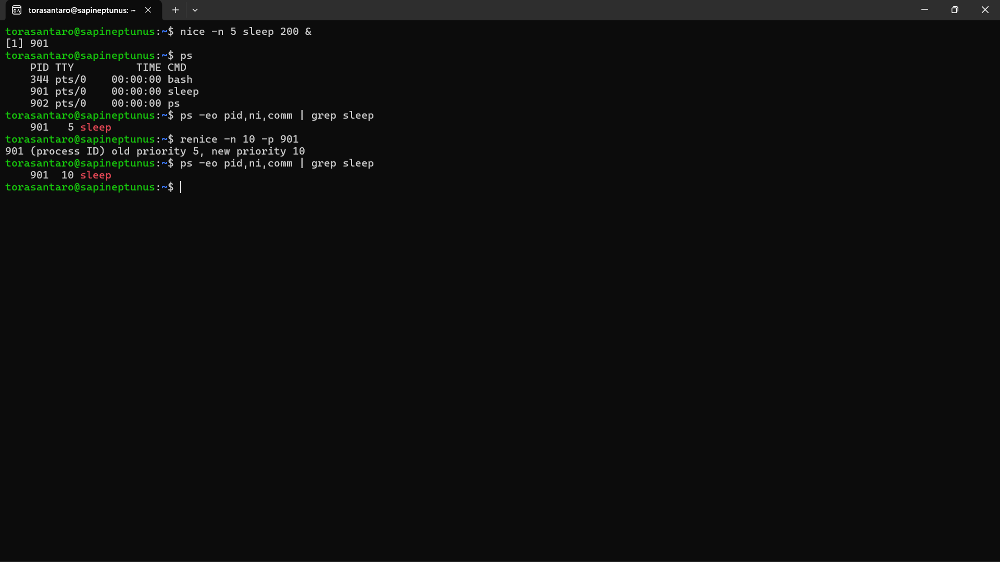
   Nilai NI berhasil diperbarui menjadi 10.

3. Coba ubah nilai nice menjadi -5 tanpa sudo. Apa yang terjadi? Mengapa
Linux membatasi hal ini untuk user biasa?
    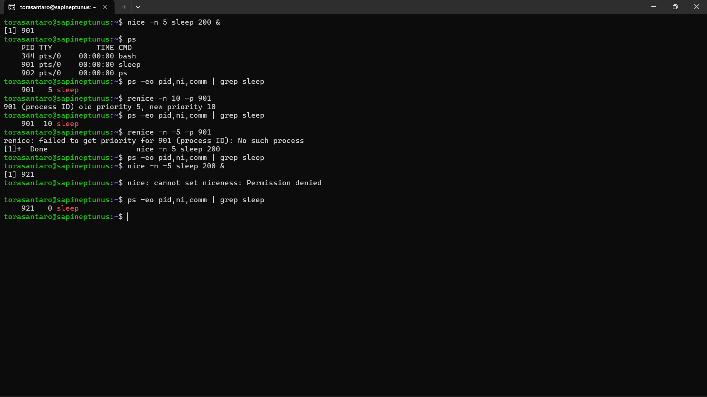
    Terminal memunculkan pesan error "Permission denied" hal ini terjadi karena Linux membatasi pemberian nilai nice negatif bagi user biasa. Nilai negatif (misalnya -5 hingga -20) berarti proses tersebut mendapatkan prioritas sangat tinggi. Jika setiap user bisa memberikan prioritas tertinggi pada programnya sendiri, sistem bisa mengalami hang karena CPU hanya melayani program user tersebut dan mengabaikan proses sistem yang kritis.

## Praktikum 6.4

### Buat proses percobaan:

### Hentikan satu proses dengan SIGTERM dan verifikasi:

### Jeda dan lanjutkan proses dengan SIGSTOP/SIGCONT:

### Hentikan semua proses sleep sekaligus:

## Latihan 6.4
1. Jalankan `sleep 400 &`, kirim SIGSTOP, dan amati perubahan kolom STAT. Kondisi apa yang muncul?
    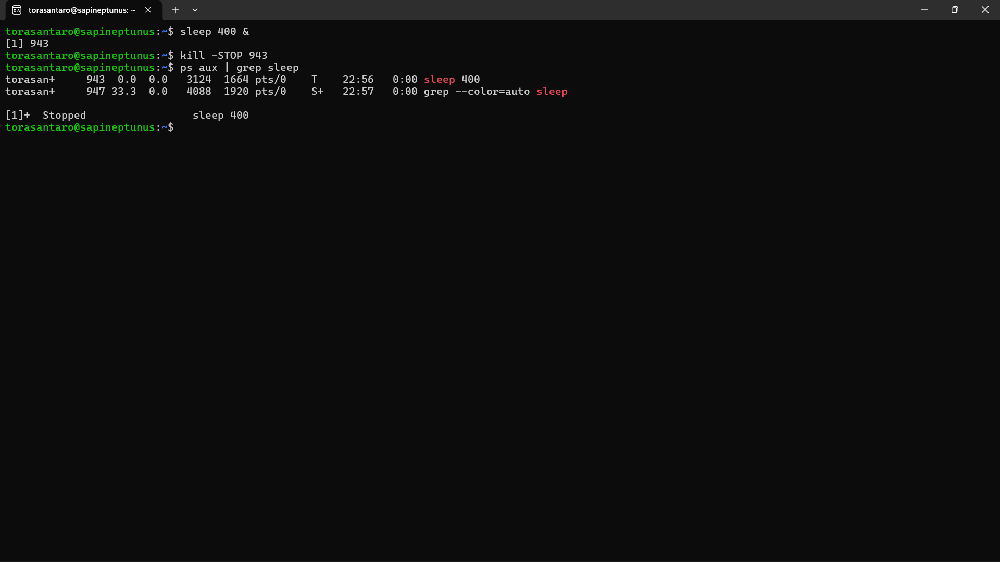
    STAT akan berubah menjadi T (Stopped by job control signal). Sinyal SIGSTOP memerintahkan menunda eksekusi proses tersebut. Proses masih ada di memori (RAM), tetapi tidak mendapatkan jatah waktu CPU sama sekali.

2. Kirim SIGCONT dan verifikasi proses kembali berjalan.
    STAT akan kembali menjadi S (Interruptible Sleep). Sinyal SIGCONT memberitahu kernel untuk memasukkan kembali proses tersebut ke dalam antrean CPU. Proses akan dilanjutkan tepat dari titik terakhir sebelum ia dihentikan.

3. Hentikan proses dengan SIGTERM lalu verifikasi sudah tidak ada. Kapan Anda memilih SIGKILL daripada SIGTERM?
    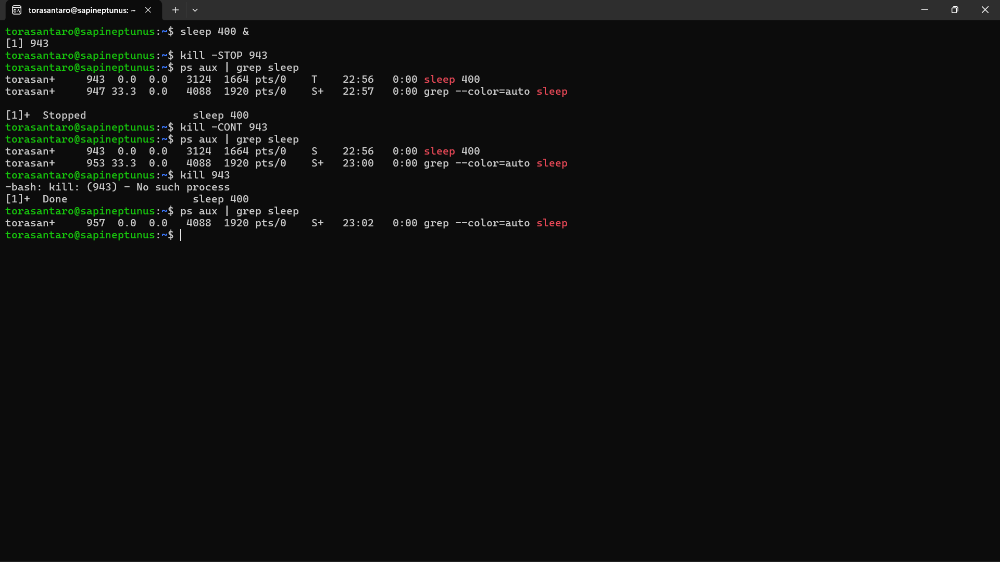
    Proses sudah tidak ada setelah dihentikan dengan SIGTERM (kill).

| Fitur | SIGTERM (15) | SIGKILL (9) |
| - | - | - |
| Sifat | Meminta | Memaksa |
| Respon Proses | Proses bisa melakukan pembersihan (simpan data,  hapus file temp). | Proses langsung dicabut dari CPU/RAM oleh Kernel. |
| Kapan Digunakan? | Gunakan selalu untuk mematikan aplikasi secara normal. | Gunakan hanya jika proses benar-benar macet (frozen). |

## Praktikum 6.5

### Jalankan tiga job di background:

### Bawa job pertama ke foreground, jeda, lalu kembalikan ke background:

### Hentikan semua job:

## Latihan 6.5
1. Jalankan `top` di foreground. Apa yang terjadi di terminal?
    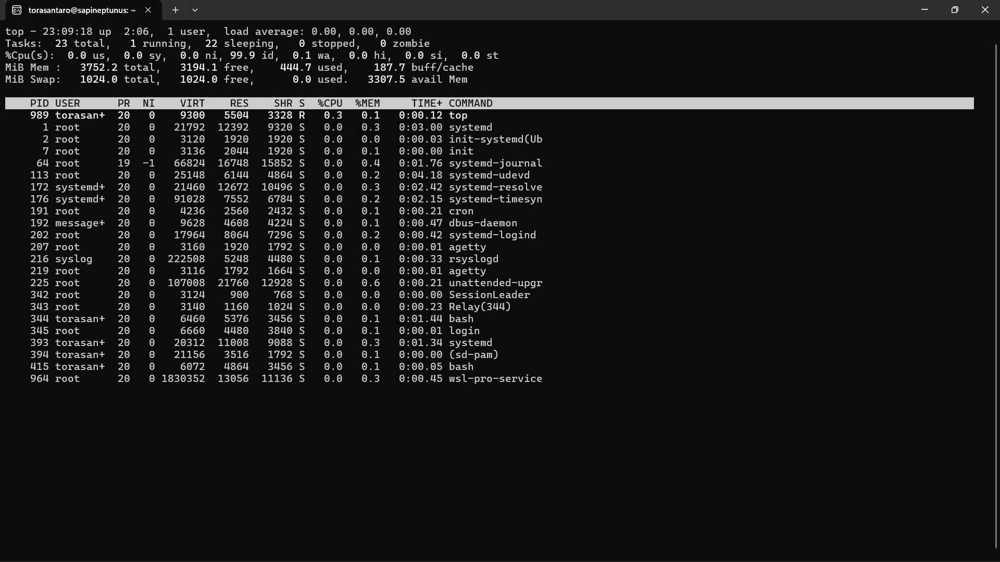
    Terminal akan berubah menjadi tampilan tabel interaktif yang memperbarui penggunaan CPU, RAM, dan daftar proses secara real-time.

2. Tekan Ctrl+Z dan cek statusnya dengan `jobs`. Kondisi apa yang ditampilkan?
    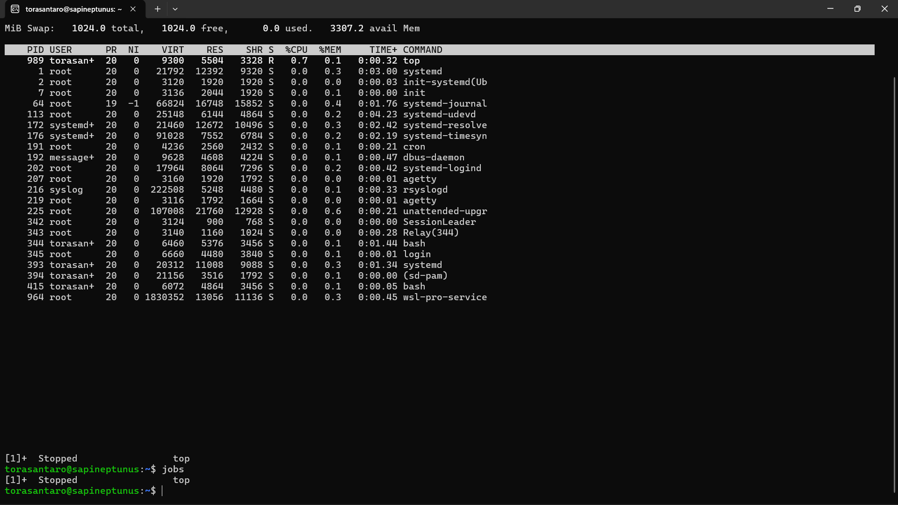
    Menekan Ctrl+Z mengirimkan sinyal SIGTSTP dan mengubah Statusnya menjadi Stopped. Ini tidak mematikan top, namun hanya menghentikannya dan memindahkannya ke latar belakang dalam kondisi tidak aktif. dan terminal sekarang dapat digunakan untuk mengetik perintah lain.

3. Pindahkan ke background dengan `bg`. Apakah `top` dapat berjalan dengan baik di background? Mengapa?
    Tidak, top tidak dapat berjalan dengan baik dan akan langsung kembali ke status Stopped. Karena top adalah aplikasi interaktif yang membutuhkan akses langsung ke layar terminal (TTY) untuk menampilkan grafis dan menerima input keyboard. Aplikasi interaktif tidak bisa berjalan di latar belakang (background) karena mereka tidak mendapat koneksi ke input terminal.

4. Kembalikan ke foreground dengan `fg`, lalu keluar dengan q .
    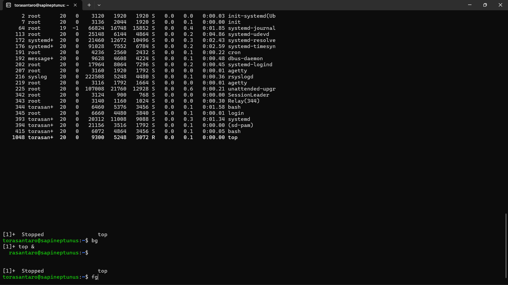
    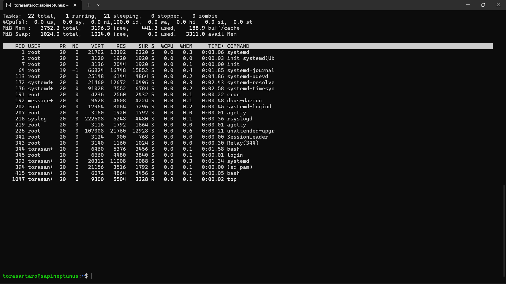
    Perintah fg (foreground) menarik kembali proses yang ada di latar belakang ke tampilan utama. Setelah top muncul kembali, menekan q (quit) adalah cara untuk keluar secara benar.

## Praktikum 6.6

### Temukan proses dengan penggunaan CPU dan memori tertinggi:

### Jalankan top dan eksplorasi shortcut-nya:

#### M

#### p (unknown command)

#### 1

#### u

#### q

### Instal dan jalankan htop:

## Latihan 6.6
1. Gunakan `ps aux --sort=%mem` untuk menemukan proses yang menggunakan memori paling banyak di VM Anda. Proses apa itu?
    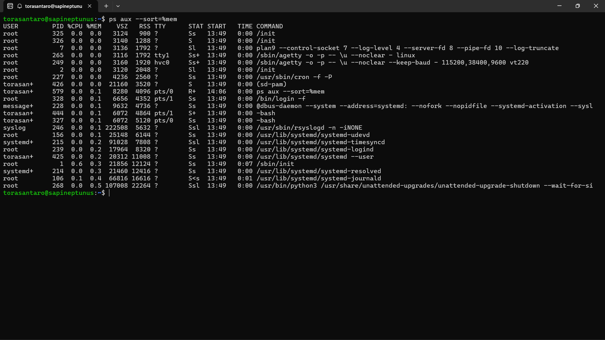
    Proses yang menggunakan memori paling banyak berdasarkan perintah tersebut adalah baris `root         268  0.0  0.5 107008 22264 ?        Ssl  13:49   0:00 /usr/bin/python3 /usr/share/unattended-upgrades/unattended-upgrade-shutdown --wait-for-si`

2. Di dalam `top`, tekan 1 . Apa yang berubah pada tampilan? Mengapa informasi ini berguna?
    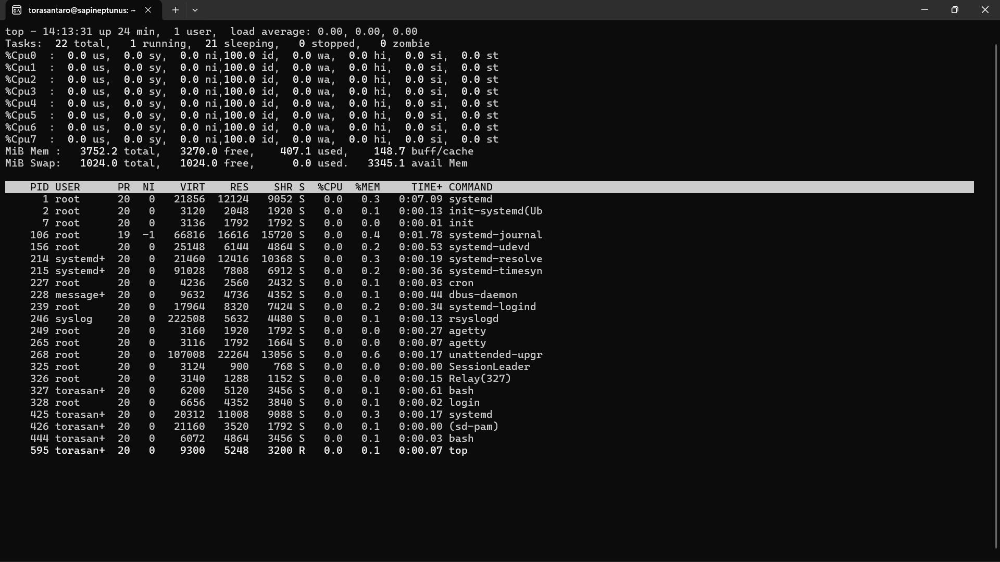
    Tampilan baris %Cpu(s) yang awal nya hanya satu baris (gabungan) akan terpecah menjadi beberapa baris sesuai jumlah core CPU Laptop (pada laptop saya jumlahnya 8 core). Dengan ini dapat melihat detail pemakaian CPU untuk setiap inti (core) prosesor secara terpisah. Informasi ini berguna karena fungsi utamanya adalah untuk memantau apakah ada satu core tertentu yang terbebani hingga 100%, sementara core lainnya hanya terpakai sedikit. Ini juga berguna untuk melihat apakah aplikasi yang berjalan terdistribusi dengan baik ke semua core atau hanya menumpuk pada satu core saja.

3. Di dalam `htop`, menavigasikan ke proses sshd menggunakan tombol panah. Tekan F9 dan amati opsi sinyal yang tersedia.
    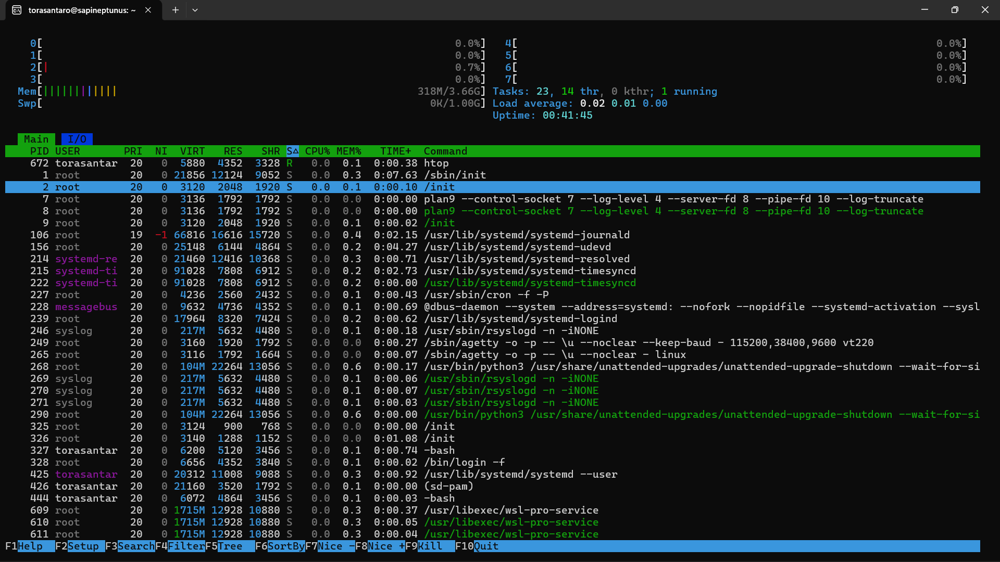
    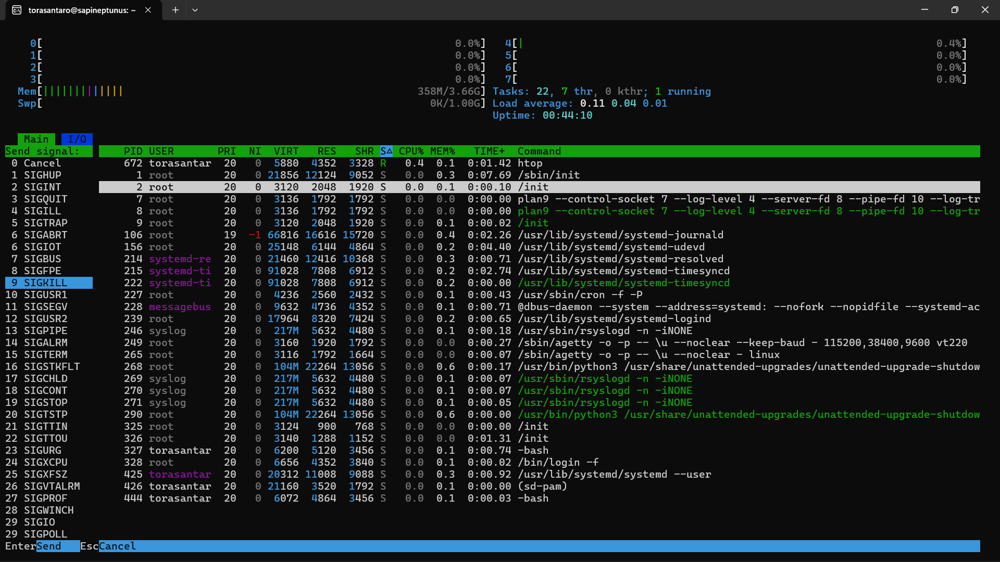
    Opsi signal yang ditampilkan sangat banyak dan lengkap serta penggunaannya lebih mudah karena hanya perlu pilih lewat daftar yang sudah disediakan tanpa perlu menghafalkannya

## Latihan

### Latihan 6.A
**Eksplorasi Proses Sistem**
1. Jalankan `ps aux –forest` dan temukan proses dengan PID 1. Apa nama dan fungsi proses tersebut dalam sistem Linux modern?
    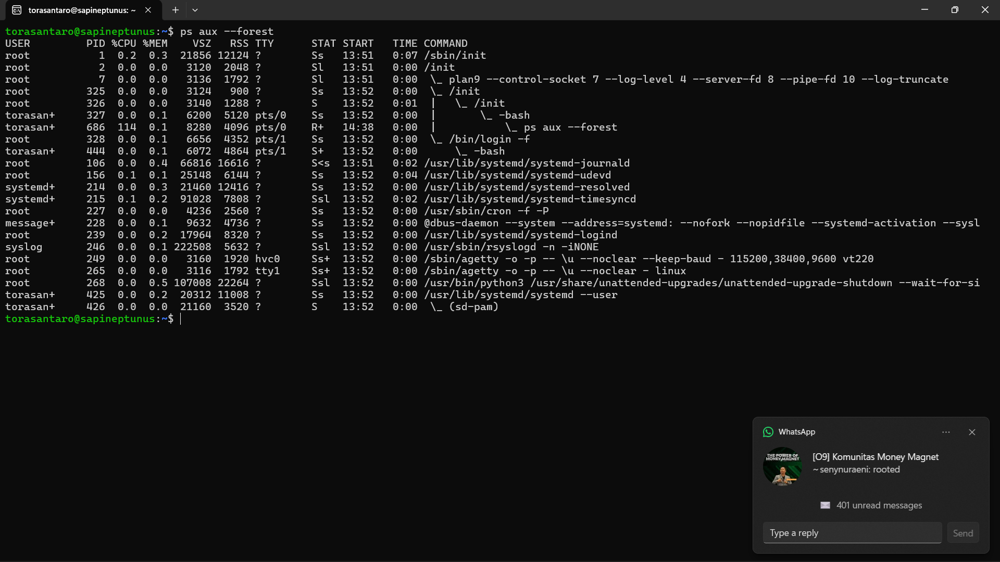
    Proses dengan PID 1 adalah `/sbin/init` ini adalah proses pertama yang dijalankan oleh kernel saat booting. Fungsinya adalah sebagai Induk dari segala proses. Ia bertugas menginisialisasi sistem, menjalankan layanan (services) dasar, dan memantau semua proses lain. Jika ada proses yang kehilangan "parent-nya" (orphan), PID 1 akan mengadopsi proses tersebut agar sistem tetap stabil.

2. Hitung berapa proses yang dimiliki oleh user root dan berapa yang dimiliki oleh user Anda. Mengapa root memiliki lebih banyak proses?
    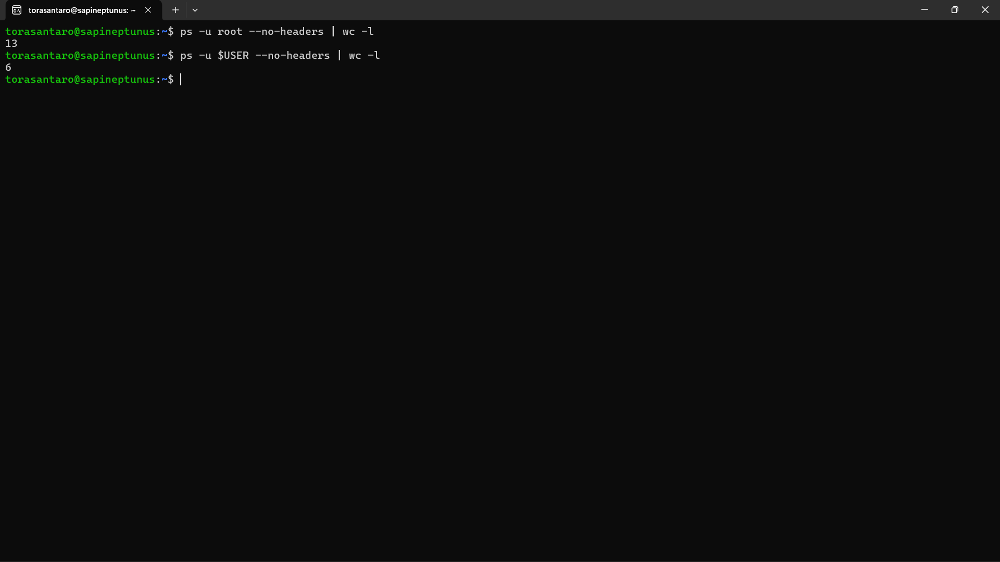
    Proses yang dimiliki oleh root sebanyak 13 dan proses yang dimiliki oleh user saya sebanyak 6. Root adalah administrator sistem yang bertanggung jawab menjalankan layanan latar belakang (daemons), pengelolaan hardware, jaringan, hingga keamanan sistem yang sudah berjalan sejak laptop pertama kali dinyalakan. Root memiliki lebih banyak proses karena User hanya menjalankan aplikasi yang dibutuhkan (seperti shell), sedangkan root menjalankan seluruh sistem operasi agar aplikasi bisa berjalan.

3. Temukan semua proses yang berada dalam kondisi S. Mengapa sebagian besar proses di sistem berada dalam kondisi ini?
    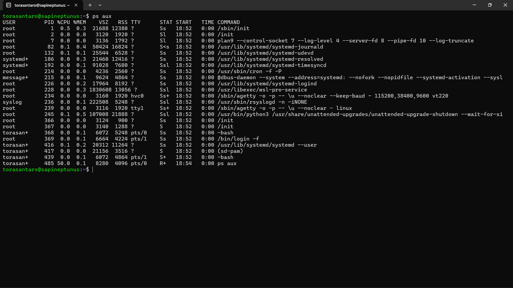
    Status S berarti Interruptible Sleep yaitu proses yang sedang berhenti sejenak menunggu sebuah kejadian (event) terjadi. Agar tidak membuang-buang siklus CPU, proses yang sedang menunggu data (misal: menunggu user mengetik perintah atau menunggu data dari internet) akan ditidurkan oleh kernel. Dengan menidurkan proses, CPU tidak perlu bekerja terus-menerus, sehingga laptop tidak cepat panas dan baterai nya lebih awet. Proses tersebut akan langsung terbangun saat data yang ditunggu sudah tersedia.

### Latihan 6.B
**Simulasi Manajemen Job**
1. Jalankan tiga perintah `sleep` dengan durasi 100, 200, dan 300 detik di background. Verifikasi ketiganya dengan `jobs`.
    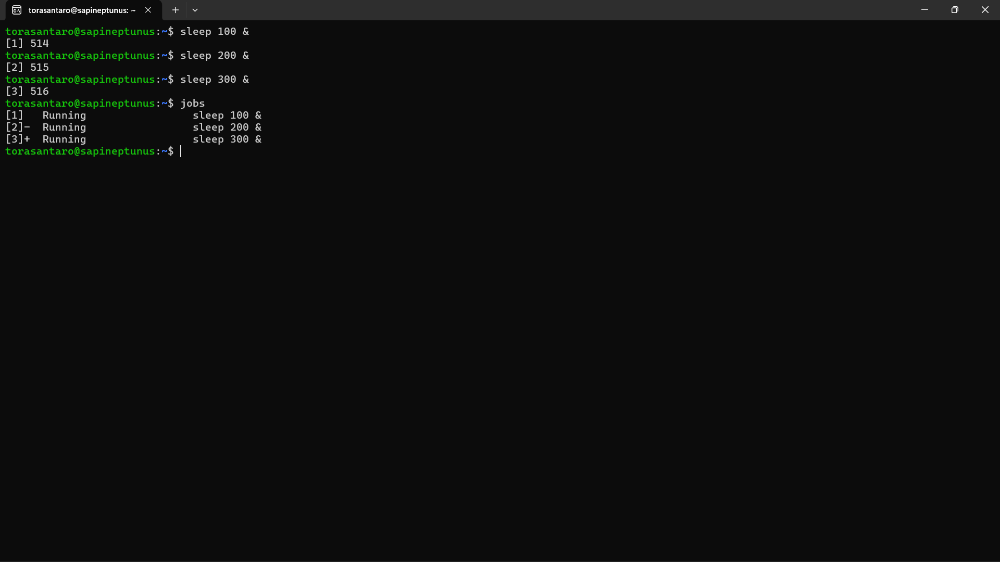

2. Bawa job kedua ke foreground, jeda dengan Ctrl+Z , lalu kembalikan ke background dengan `bg`.
    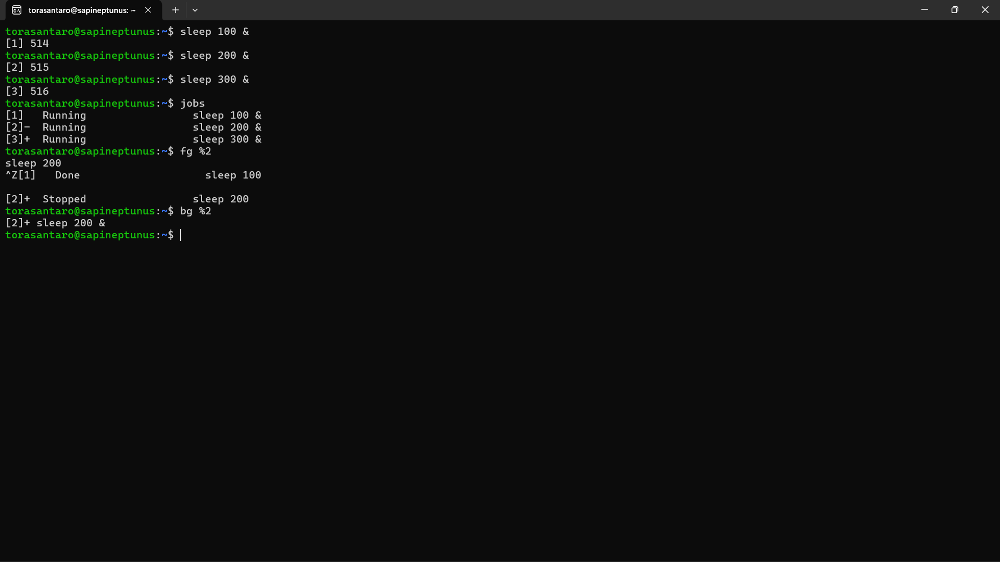

3. Hentikan job pertama dengan `kill %1`. Tampilkan kembali daftar job. Berapa job yang tersisa?
    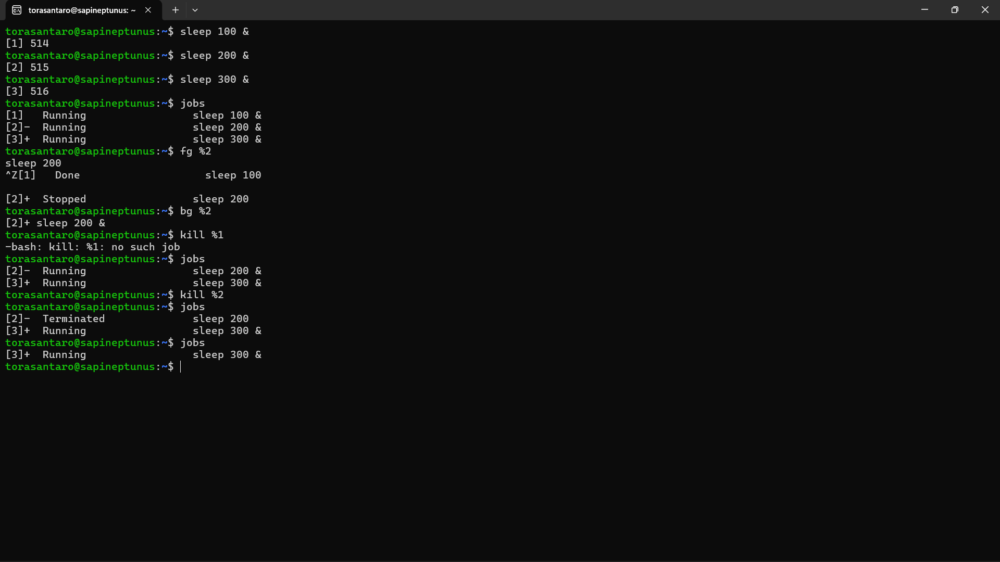
    Ketika saya jalankan `kill %1` ternyata sleep 100 yang merupakan job 1 telah selesai, jadi saya jalankan `kill %2` sebagai pengganti, sehingga job yang tersisa tinggal 1 job yaitu job ke 3 (sleep 300).
 
### Latihan 6.C
**Prioritas dan Sinyal**
1. Jalankan dua proses sleep: satu dengan nice +5 dan satu dengan nice +15. Verifikasi nilai NI keduanya dengan `ps`.
    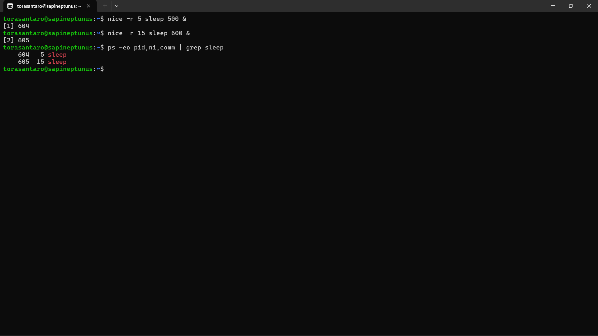

2. Gunakan `renice` untuk mengubah nice proses pertama menjadi +10. Proses mana yang kini lebih diprioritaskan scheduler?
    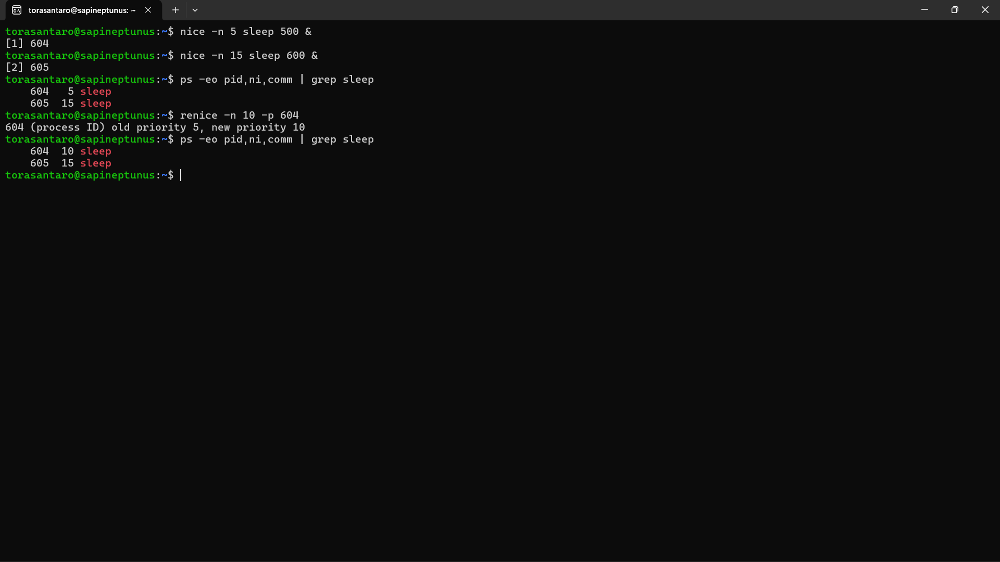
    Proses pertama (+10) masih lebih diprioritaskan oleh scheduler dibandingkan proses kedua (+15). Karena semakin rendah nilai nice, semakin tinggi prioritas nya. Karena 10 lebih kecil daripada 15, maka proses pertama mendapatkan jatah waktu CPU yang lebih banyak daripada proses kedua.

3. Kirim SIGSTOP ke salah satu proses, verifikasi kondisi T-nya, lalu kirim SIGCONT. Akhiri semua proses percobaan dengan `pkill sleep`.
    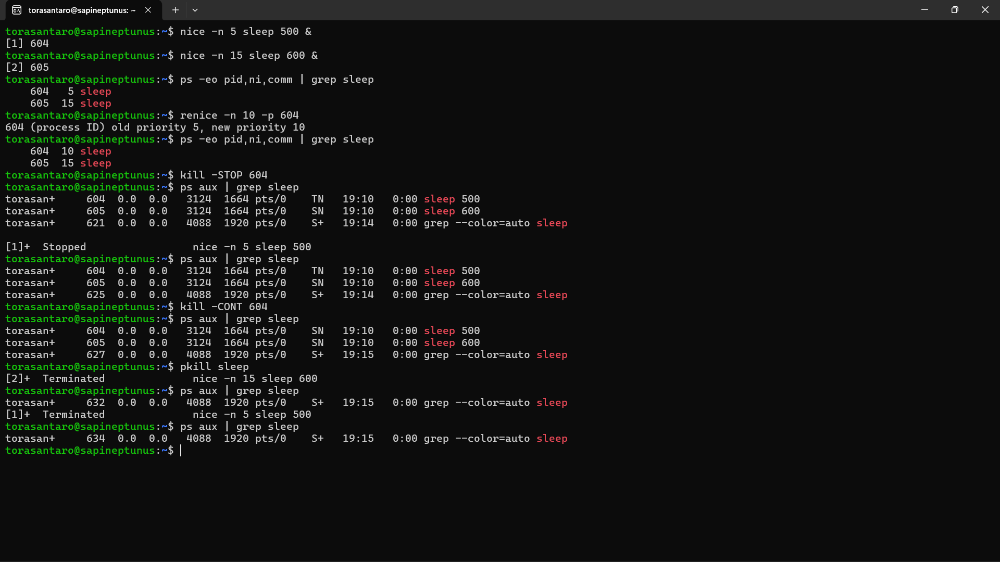

 